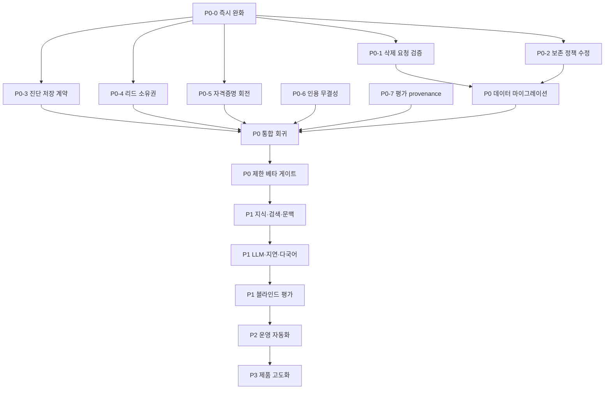

# KARXY 서비스 안정화 및 품질 고도화 마스터 플랜

> 작성 기준: 2026-08-01 운영 심층 감사
>
> 적용 범위: KARXY 웹 애플리케이션, Typebot, n8n, Supabase/PostgreSQL/pgvector,
> OpenAI Embeddings, Kimi/보조 LLM, 상담원 운영 도구, 운영 자동화
>
> 문서 상태: 실행 계획 초안. 각 항목은 구현 PR, 마이그레이션, 테스트 증적,
> 운영 배포 증적이 모두 연결된 뒤 완료로 변경한다.

## 1. 문서 목적

이 문서는 현재 시스템에서 확인된 문제를 단순한 개선 목록이 아니라 실제 개발과
운영 작업으로 실행할 수 있는 단위로 분해한다. 각 작업에는 다음 정보를 포함한다.

- 현재 결함과 사용자 영향
- 즉시 적용할 임시 완화책
- 목표 아키텍처와 데이터 계약
- 변경 대상 코드와 데이터베이스
- 테스트 시나리오와 실패 조건
- 배포, 모니터링, 롤백 절차
- 완료 정의와 다음 작업의 선행 조건

이 문서의 핵심 원칙은 기능 수를 늘리는 것이 아니라 다음 순서로 위험을 줄이는 것이다.

1. 개인정보와 사용자 데이터의 오작동을 먼저 차단한다.
2. 평가와 운영 지표가 실제 상태를 정직하게 반영하게 만든다.
3. RAG 문서와 검색 품질을 올린다.
4. 응답 속도, 다국어, 상담원 운영 경험을 개선한다.
5. 검증된 상태에서만 일반 공개 범위를 넓힌다.

## 2. 현재 운영 기준선

### 2.1 확인된 정상 요소

| 항목 | 현재 상태 | 증거 |
| --- | --- | --- |
| 운영 DB | Supabase PostgreSQL 연결 및 쓰기 가능 | `/api/readiness` managed writable 통과 |
| 스키마 | 최신 마이그레이션 적용 | `20260722210000_diagnosis_current_visa` |
| RAG serving | 승인 문서 95개, 청크 204개 | 204/204 citation-ready |
| 임베딩 | OpenAI `text-embedding-3-small` | 1536차원, vector coverage 100% |
| 검색 함수 | Hybrid pgvector | `match_rag_documents_hybrid_v3` |
| n8n | 활성 오케스트레이터 실행 가능 | 최근 확인 범위 159/159 workflow success |
| Typebot | 공개 bot 게시 및 HTTP 접근 가능 | 공개 URL 200 |
| 대화 저장 | canonical session/message/retrieval 저장 구조 존재 | chat persistence 테스트 통과 |
| 상담 전환 | handoff, contact, SLA, review feedback 구조 존재 | 관련 마이그레이션과 테스트 존재 |

### 2.2 서비스 공개를 막는 기준선

| 문제 | 현재 관측값 | 출시 영향 |
| --- | --- | --- |
| 진단 저장 | 실제 다국어 결과가 API schema와 불일치 | 리드가 서버에 저장되지 않아도 성공처럼 보임 |
| 개인정보 삭제 | 익명 요청이 타인 데이터까지 삭제 예약 가능 | 데이터 무결성 및 개인정보 침해 위험 |
| 개인정보 보존 | 암호화된 행이 retention 필터와 영구 불일치 | 보존 기간 이후에도 ciphertext 잔존 가능 |
| 파트너 리드 소유권 | client-supplied `leadId`를 신뢰 | 타인 연락처 및 동의 정보 변조 가능 |
| 평가 게이트 | runtime provenance와 기대값 불일치 | 0/10 같은 오판으로 품질 판단 불가 |
| 응답 속도 | 운영 평가 p50 약 16초, p95 약 21.6초 | 대화 이탈 위험이 높음 |
| 후속 질문 | D-4 문맥을 가진 `그중 ... 다시`를 놓침 | 일반 챗봇보다 대화 품질이 낮게 느껴짐 |
| 지식 범위 | D-4 연장 세부 수수료/서류 근거 부족 | 일반 신청 문서로 부분 답변 |
| 공급자 복원력 | primary와 fallback이 모두 Moonshot 계열, failover off | 실질적인 공급자 이중화 없음 |
| 운영 이벤트 | 미확인 이벤트 652건 | 중요한 장애와 반복 경고 구분 어려움 |

## 3. 우선순위와 공개 정책

### 3.1 우선순위 정의

| 우선순위 | 의미 | 공개 정책 |
| --- | --- | --- |
| P0 | 개인정보, 데이터 무결성, 인용 정직성, 평가 신뢰성 문제 | 완료 전 일반 공개 금지 |
| P1 | 답변 정확도, 문맥, 지식 범위, 지연, 다국어 문제 | 제한 베타 확대 전 완료 |
| P2 | 운영 경보, SLA, 파일 보안, 자동 E2E 문제 | 유료 서비스 전 완료 |
| P3 | UX, 분석, 문서 정리, 운영 생산성 문제 | 병행 가능하나 P0/P1을 방해하지 않음 |

### 3.2 P0 기간의 임시 운영 정책

- 홈페이지와 챗봇에 `공식 자료 기반 일반 안내` 범위를 유지한다.
- 고위험 체류, 불법 취업, 강제퇴거, 입국금지, 행정소송 질문은 자동 답변보다
  상담원 검토를 우선한다.
- 개인정보 삭제 API는 검증 요청 접수만 허용하고 자동 삭제 예약을 중단한다.
- 파트너 연결은 소유권을 확인할 수 없는 기존 `leadId`를 수정하지 않는다.
- 첨부 기능은 외부 scanner 도입 전까지 허용 파일 형식과 크기를 최소화한다.
- 품질 평가는 provenance 복구 전까지 참고 지표로만 사용하고 release pass로 사용하지 않는다.

## 4. 전체 실행 의존성



# P0. 출시 차단 문제 해결

## P0-0. 즉시 피해 완화와 변경 동결

### 목표

영구 수정이 배포되기 전까지 새로운 개인정보 삭제 오작동, 타인 리드 변조,
노출된 자격증명 사용을 막는다.

### 구현 작업

- [ ] `/api/privacy/delete-request`에 kill switch를 추가한다.
- [ ] production 기본값을 `PRIVACY_DELETION_AUTOMATION_ENABLED=false`로 설정한다.
- [ ] kill switch가 꺼진 상태에서는 `202 Accepted`와 접수 ID만 반환한다.
- [ ] 이 상태에서 `DiagnosisLead`, `ChatLog`, `ChatSession`의 `deleteRequestedAt`을 수정하지 않는다.
- [ ] `/api/partner-requests`에서 기존 lead 수정 경로를 임시 비활성화한다.
- [ ] 검증되지 않은 `leadId`는 새 anonymous lead로 교체한다.
- [ ] 현재 삭제 예약 행을 dry-run으로 추출하고 운영 검토 파일을 만든다.
- [ ] P0 작업 중 knowledge 자동 승인과 대량 삭제 job을 일시 중지한다.
- [ ] Typebot gateway secret 노출에 대한 보안 이벤트를 남긴다.

### 변경 예상 파일

- `src/app/api/privacy/delete-request/route.ts`
- `src/app/api/partner-requests/route.ts`
- `src/lib/partners/repository.ts`
- `src/lib/privacy/config.ts`
- `src/lib/ops/readiness.ts`
- `docs/OPERATIONS.md`

### 검증

1. 익명 삭제 요청이 202를 반환해도 어떤 사용자 테이블도 변경되지 않아야 한다.
2. 임의의 기존 `leadId`를 넣은 partner request가 해당 lead를 수정하지 않아야 한다.
3. 관리자 audit log에는 요청 hash, 요청 시각, IP hash, 처리 상태만 남아야 한다.
4. 질문 원문과 연락처 원문은 운영 이벤트에 기록하지 않아야 한다.

### 롤백

kill switch는 코드 롤백 없이 환경변수로 동작을 유지할 수 있어야 한다. 영구 수정 전에는
어떤 경우에도 자동 삭제를 다시 활성화하지 않는다.

## P0-1. 개인정보 삭제 요청 검증 체계

### 현재 문제

`POST /api/privacy/delete-request`는 인증 없이 `leadId`, `contact`, `question` 중 하나만
받아 관련 레코드의 `deleteRequestedAt`을 설정한다. 동일한 질문 문장은 여러 사용자가
사용할 수 있으므로 질문 hash는 신원 증명이 될 수 없다.

### 목표 상태

삭제 요청 접수, 소유권 검증, 운영 검토, soft-delete, hard-delete를 분리한다.

### 제안 데이터 모델

새 Prisma model `PrivacyDeletionRequest`를 추가한다.

| 필드 | 타입 | 용도 |
| --- | --- | --- |
| `id` | UUID | 외부에 노출 가능한 요청 ID |
| `requesterUserId` | nullable UUID | 로그인 사용자 |
| `sessionKeyHash` | nullable string | 익명 chat session 연결 |
| `subjectType` | enum | `account`, `lead`, `chat_session`, `contact` |
| `subjectHash` | string | 검증 대상 식별자 HMAC |
| `verificationChannel` | enum | `email`, `sms`, `authenticated_session` |
| `verificationTokenHash` | nullable string | 일회용 확인 token hash |
| `status` | enum | `pending_verification`, `verified`, `approved`, `soft_deleted`, `completed`, `rejected`, `expired` |
| `expiresAt` | datetime | 확인 링크 만료 |
| `verifiedAt` | nullable datetime | 소유권 검증 완료 |
| `approvedAt` | nullable datetime | 자동 정책 또는 운영자 승인 |
| `approvedBy` | nullable UUID | 운영자 |
| `softDeletedAt` | nullable datetime | 복구 유예 시작 |
| `completedAt` | nullable datetime | hard-delete 완료 |
| `scopeSummary` | JSON | 삭제 대상 종류와 개수, PII 제외 |
| `createdAt`, `updatedAt` | datetime | 감사 |

### API 계약

#### `POST /api/privacy/delete-request`

입력:

```json
{
  "subjectType": "contact",
  "contact": "user@example.com",
  "locale": "ko"
}
```

동작:

- `question` 입력은 완전히 제거한다.
- 로그인 사용자는 session identity를 우선한다.
- 익명 연락처 요청은 OTP 또는 확인 링크를 발송한다.
- 존재 여부를 노출하지 않도록 항상 동일한 응답 형태를 사용한다.
- token 원문을 DB나 로그에 저장하지 않는다.

응답:

```json
{
  "accepted": true,
  "requestId": "uuid",
  "status": "pending_verification",
  "message": "확인 절차가 필요한 경우 입력한 연락처로 안내합니다."
}
```

#### `GET /api/privacy/delete-request/verify?token=...`

- token hash와 만료 시간을 확인한다.
- 1회 사용 후 token을 무효화한다.
- 검증 성공 시에만 삭제 대상 scope를 계산한다.
- 동일 subject의 열린 요청은 하나만 유지한다.

#### `POST /api/admin/privacy/delete-requests/:id/approve`

- `owner` 또는 별도 privacy role만 허용한다.
- 대상 수가 0이어도 정상적으로 종료하되 상태를 구분한다.
- 대량 범위 기준을 초과하면 2인 승인 정책을 적용할 수 있게 확장 지점을 둔다.

### 삭제 처리 정책

1. `verified` 전에는 운영 데이터에 어떤 삭제 표시도 하지 않는다.
2. 승인 후 `deletedAt`을 설정하고 서비스 조회에서 제외한다.
3. 7일 복구 유예 기간 동안 관계 레코드를 hard-delete하지 않는다.
4. 유예 종료 후 첨부 storage object부터 삭제한다.
5. message, retrieval, audit metadata, handoff, contact 순으로 정리한다.
6. 법적 보존 의무가 있는 감사 항목은 PII를 제거하고 최소 메타데이터만 보존한다.
7. 각 단계는 idempotent해야 하며 재실행 시 중복 오류가 없어야 한다.

### 테스트 매트릭스

| 시나리오 | 기대 결과 |
| --- | --- |
| 공통 질문 문자열로 삭제 요청 | 거부 또는 validation error |
| 타인의 leadId 입력 | 대상 0, 원본 변경 없음 |
| 동일 연락처를 가진 두 테스트 계정 | 검증된 subject scope만 처리 |
| 만료된 token | 410 또는 expired 상태 |
| token 재사용 | 두 번째 요청 거부 |
| 로그인 사용자 자신의 전체 삭제 | 자신의 연결 데이터만 soft-delete |
| hard-delete job 중간 실패 | 다음 실행에서 남은 단계부터 재개 |
| 삭제 유예 중 취소 | 데이터 복구 및 status `cancelled` |

### 운영 지표

- `privacy_delete_request_created_total`
- `privacy_delete_request_verified_total`
- `privacy_delete_request_rejected_total`
- `privacy_delete_scope_record_count`
- `privacy_delete_job_failure_total`
- 검증에서 완료까지 p50/p95 시간

### 완료 조건

- [ ] 미인증 요청이 삭제 대상 필드를 변경하는 경로가 0개다.
- [ ] 질문 hash 기반 삭제 코드가 제거됐다.
- [ ] soft-delete 유예 및 복구 테스트가 있다.
- [ ] 삭제 작업의 대상 수와 결과가 관리자 감사 화면에 보인다.
- [ ] 개인정보 처리방침의 설명과 실제 코드가 일치한다.

## P0-2. 개인정보 보존 및 암호문 삭제

### 현재 문제

쓰기 시 암호화가 성공하면 `questionRedacted` 또는 `contactRedacted`가 이미 `true`가 된다.
그러나 retention query는 `false`인 행만 선택하므로 production ciphertext가 만료 이후에도
남을 수 있다.

### 설계 원칙

- `redacted`는 표시용 plaintext 상태다.
- `retentionProcessedAt`은 보존 정책 처리 상태다.
- 두 의미를 같은 boolean으로 표현하지 않는다.
- ciphertext와 lookup hash도 개인정보로 취급한다.

### 스키마 변경

다음 모델에 `retentionProcessedAt DateTime?`을 추가한다.

- `ChatLog`
- `PartnerRequest`
- `DiagnosisLead`
- 필요한 경우 `ChatMessage`, `HandoffLeadContact`

선택적으로 `retentionVersion String?`을 추가해 정책 버전을 기록한다.

### 마이그레이션 계획

1. nullable 필드와 인덱스를 추가한다.
2. 기존 행은 `retentionProcessedAt=null`로 둔다.
3. production dry-run으로 만료 대상을 테이블별 집계한다.
4. 작은 batch로 ciphertext 제거를 실행한다.
5. 성공한 행만 `retentionProcessedAt`과 `retentionVersion`을 기록한다.
6. 24시간 관찰 후 cron을 새 경로로 전환한다.

### 대상별 제거 필드

| 모델 | 제거 또는 무효화 대상 |
| --- | --- |
| `ChatLog` | question plaintext, ciphertext, questionHash, delete token 연결 |
| `PartnerRequest` | question plaintext, ciphertext, questionHash, 노출용 excerpt |
| `DiagnosisLead` | contact, ciphertext, contactHash, contactType, nickname 필요 시 익명화 |
| `ChatMessage` | content ciphertext, questionHash, attachment reference |
| `ChatAttachment` | storage object, extracted text, OCR result, checksum 연결 |
| `HandoffLeadContact` | contact ciphertext, hash, display value |

### job 동작

- `dryRun=true`는 count와 sample ID hash만 반환한다.
- 각 batch는 상한을 두고 cursor 기반으로 처리한다.
- 한 모델 실패가 다른 모델의 성공을 숨기지 않는다.
- `processed`, `skipped`, `failed`, `remaining`을 별도로 보고한다.
- 0건일 때도 실제 만료 대상 count를 먼저 비교한다.
- Typebot provider result 삭제는 별도 step으로 격리한다.

### 테스트

- [ ] 실제 `preparePiiField()`를 사용해 암호화된 fixture를 생성한다.
- [ ] `redacted=true`인 암호화 행도 만료 시 ciphertext가 제거되는지 확인한다.
- [ ] 만료 전 행이 변경되지 않는지 확인한다.
- [ ] dry-run이 실제 처리와 같은 대상 수를 계산하는지 확인한다.
- [ ] batch 중간 실패 후 재시작이 안전한지 확인한다.
- [ ] Typebot API 실패가 내부 DB retention 성공을 되돌리지 않는지 확인한다.
- [ ] 삭제 후 serializer가 원문을 복원하지 못하는지 확인한다.

### 롤백

스키마 필드는 additive로 배포한다. 새 job에 문제가 있으면 cron을 비활성화하고 기존 행을
변경하지 않는다. 이미 제거한 ciphertext는 복구하지 않는 것이 정상 동작이므로 롤백 대상이
아니다.

### 완료 조건

- [ ] production dry-run과 처리 결과 차이가 0이다.
- [ ] 만료된 ciphertext 잔존 count가 0이다.
- [ ] retention job 실패 시 Slack 경보와 ops event가 생성된다.
- [ ] 처리 결과가 daily health에 포함된다.

## P0-3. 진단 저장 API와 프론트엔드 상태 계약

### 현재 문제

`recommendPath()`는 `warnings`, `nextActions`를 다국어 객체 배열로 반환하지만
`POST /api/leads`는 문자열 배열만 허용한다. 요청이 400이어도 Zustand store가
`local-*` ID를 만들어 성공으로 처리한다.

### canonical 타입

```ts
type LocalizedText = {
  ko: string;
  en: string;
  vi: string;
  mn: string;
};

type DiagnosisWritePayload = {
  warnings: LocalizedText[];
  nextActions: LocalizedText[];
};
```

### 구현 작업

- [ ] Zod schema에 `localizedTextSchema`를 한 번 정의해 재사용한다.
- [ ] diagnosis engine, API route, Prisma JSON 필드, serializer, store 타입을 통일한다.
- [ ] 실제 `recommendPath()` 결과로 API contract test fixture를 만든다.
- [ ] API error body에 `code`, `retryable`, `fieldErrors`, `requestId`를 포함한다.
- [ ] 4xx는 `contract_error`, 5xx와 network error는 `retryable_error`로 분리한다.
- [ ] 4xx에서 로컬 lead를 만들지 않는다.
- [ ] network error만 `pending-sync` outbox에 저장한다.
- [ ] outbox 항목에 idempotency key를 저장한다.
- [ ] 서버는 idempotency key로 중복 lead 생성을 방지한다.
- [ ] UI에 저장 중, 저장 완료, 재시도 대기, 저장 실패 상태를 구분한다.
- [ ] 관리자 화면에서 local-only lead를 서버 lead처럼 보여주지 않는다.

### API 응답 계약

성공:

```json
{
  "ok": true,
  "persisted": true,
  "lead": { "id": "uuid" },
  "requestId": "uuid"
}
```

검증 실패:

```json
{
  "ok": false,
  "persisted": false,
  "code": "LEAD_PAYLOAD_INVALID",
  "retryable": false,
  "fieldErrors": {
    "warnings": ["Expected localized text"]
  },
  "requestId": "uuid"
}
```

### 테스트

- 4개 locale과 모든 diagnosis path를 순회한다.
- engine 결과를 수정 없이 route에 전달하고 201을 기대한다.
- schema가 변하면 fixture 생성 단계에서 CI가 실패해야 한다.
- 400, 401, 409, 429, 500, timeout, offline을 각각 UI 상태로 검증한다.
- 동일 idempotency key 재전송 시 lead가 하나만 생성돼야 한다.
- 재시도 대기 항목이 성공하면 local state의 ID가 server ID로 교체돼야 한다.

### 완료 조건

- [ ] production synthetic diagnosis 24개 조합이 모두 저장된다.
- [ ] 서버 저장 실패를 성공처럼 표시하는 경로가 없다.
- [ ] 관리자 inbox에서 테스트 lead를 확인할 수 있다.
- [ ] 저장 성공률과 실패 code가 product analytics에 PII 없이 기록된다.

## P0-4. 리드 소유권과 파트너 연결 권한

### 현재 문제

파트너 요청이 browser에서 받은 `leadId`를 그대로 사용해 해당 lead의 이름, 연락처,
동의 기록을 수정할 수 있다.

### 소유권 모델

| 사용자 유형 | lead 소유권 증명 |
| --- | --- |
| 로그인 사용자 | `DiagnosisLead.userId === session.user.id` |
| 익명 진단 사용자 | 서명된 `lead_access` HttpOnly cookie의 lead ID와 nonce |
| Typebot 사용자 | 서명된 KARXY chat session과 연결된 lead ID |
| 관리자 | server-side role authorization과 audit reason |
| 파트너 | 자신에게 배정된 request/handoff만 접근 |

### 구현 작업

- [ ] `resolveOwnedLead()` 서버 helper를 만든다.
- [ ] body의 `leadId`는 lookup hint로만 사용한다.
- [ ] 소유권 불일치 시 기존 행을 절대 update하지 않는다.
- [ ] 익명 사용자가 새 partner request를 만들면 anonymous lead를 서버가 생성한다.
- [ ] 연락처 update와 partner request create를 transaction으로 묶는다.
- [ ] consent snapshot은 검증된 lead에만 기록한다.
- [ ] 관리자 override에는 필수 reason을 요구한다.
- [ ] partner serializer에서 미배정 PII를 반환하지 않는다.
- [ ] 기존 browser-held lead ID의 예측 가능성과 노출 위치를 점검한다.

### 보안 테스트

1. 사용자 A의 lead ID를 사용자 B session으로 수정 시도한다.
2. 익명 session A가 익명 session B lead를 수정 시도한다.
3. 서명 cookie 변조와 만료를 검증한다.
4. 파트너 A가 파트너 B의 handoff를 조회한다.
5. 소유권 실패 시 consent row가 만들어지지 않는지 확인한다.
6. 오류 응답으로 lead 존재 여부를 추측할 수 없는지 확인한다.

### 완료 조건

- [ ] 모든 lead mutation route가 공통 ownership helper를 사용한다.
- [ ] IDOR 회귀 테스트가 CI에 포함된다.
- [ ] partner PII 조회가 배정 및 동의 조건을 동시에 요구한다.
- [ ] 보안 실패는 PII 없이 audit log에 기록된다.

## P0-5. 자격증명 회전과 비밀 관리

### 회전 대상

- `TYPEBOT_GATEWAY_SECRET`
- n8n MCP bearer token
- `N8N_WEBHOOK_SIGNING_SECRET`
- `N8N_ERROR_REPORTING_SECRET`
- 내부 admin API key와 GitHub Actions secret 일치 여부
- Typebot provider API token
- 필요 시 노출 범위가 불명확한 AI provider key

### 회전 순서

1. 각 verifier가 `PRIMARY`와 `PREVIOUS`를 모두 받을 수 있는지 확인한다.
2. 새 32-byte 이상 secret을 provider별로 생성한다.
3. Vercel에 primary=new, previous=old를 배포한다.
4. Railway n8n credential과 workflow header를 새 값으로 바꾼다.
5. Typebot 4개 locale의 runtime/handoff webhook header를 새 값으로 바꾼다.
6. draft에서 synthetic E2E를 통과한다.
7. Typebot과 n8n을 publish/active 상태로 전환한다.
8. production E2E를 20회 실행한다.
9. old secret 사용 로그가 0인지 확인한다.
10. 24시간 이내 `*_PREVIOUS`를 제거한다.

### 금지 사항

- secret 원문을 GitHub issue, PR body, Slack, ops event에 기록하지 않는다.
- 여러 서비스가 동일한 secret을 재사용하지 않는다.
- `DATA_ENCRYPTION_KEY`는 단순 교체하지 않는다. versioned keyring과 재암호화 계획 없이
  교체하면 기존 데이터를 복호화할 수 없다.
- `PII_HASH_SECRET`은 dual hash lookup과 backfill 없이 교체하지 않는다.

### 검증

- [ ] repository secret scan
- [ ] Git history secret scan
- [ ] Vercel env 목록의 scope 확인
- [ ] Railway credential owner 확인
- [ ] Typebot header update 확인
- [ ] old secret negative test
- [ ] new secret positive test
- [ ] rotation timestamp 갱신

### 완료 조건

- 노출된 기존 값이 모든 provider에서 폐기됐다.
- old value로 runtime, handoff, error report 호출이 모두 401/403을 반환한다.
- readiness의 credential age가 새 회전일을 반영한다.

## P0-6. 인용 무결성과 답변 정직성

### 현재 문제

- `remapCitations()`가 `usedSourceIndexes`에 없는 인용 번호를 그대로 남긴다.
- 정적 FAQ fallback이 실제 근거 관계 없이 `[1]`을 붙일 수 있다.
- 부분 근거가 전체 답변을 지지하는 것처럼 보일 수 있다.

### 목표 계약

모든 factual claim의 citation은 최종 `sources` 배열의 실제 항목과 대응해야 한다.

```ts
type CitationAudit = {
  citedIndexes: number[];
  sourceCount: number;
  invalidIndexes: number[];
  uncitedClaimCount: number;
  valid: boolean;
};
```

### 구현 작업

- [ ] unmapped citation을 그대로 보존하지 않는다.
- [ ] invalid citation 발견 시 answer를 `invalid_generation`으로 downgrade한다.
- [ ] `usedSourceIndexes`와 answer marker를 양방향 검증한다.
- [ ] source가 1개면 `[2]` 이상을 허용하지 않는다.
- [ ] static FAQ는 citation을 만들지 않는다.
- [ ] extractive fallback은 어떤 문장이 어떤 chunk에서 왔는지 명시적으로 구성한다.
- [ ] 복합 질문은 intent별 `supported`, `missing` 상태를 반환한다.
- [ ] 비용, 법적 기간, 필수 서류처럼 위험한 claim은 source 없는 생성을 금지한다.
- [ ] source URL, checkedAt, document ID, chunk ID를 persistence에 함께 저장한다.

### 회귀 테스트

- `[1]`, `[3]`을 쓰고 `usedSourceIndexes=[3]`인 경우
- source 1개인데 `[2]`를 쓰는 경우
- `supported=false`인데 answer text가 있는 경우
- citation이 하나도 없는 factual answer
- source marker는 있지만 source URL이 없는 경우
- source checkedAt이 만료된 경우
- FAQ와 검색 문서가 서로 다른 주장을 하는 경우
- locale 번역 중 citation marker 순서가 바뀌는 경우

### 완료 조건

- citation precision 100%
- dangling citation 0건
- invalid generation이 사용자에게 근거 있는 답변으로 노출되는 경로 0개
- 관련 테스트가 `ci:domain` 또는 별도 required check에 포함됨

## P0-7. RAG provenance와 평가 게이트 복구

### 현재 문제

n8n이 요청을 오케스트레이션하지만 내부 검색은 KARXY direct hybrid가 수행한다. 응답의
runtime path는 n8n인데 retrieval provenance는 direct 값이므로 단일 workflow 필드로
비교하는 현재 평가는 정상 응답도 mismatch로 처리한다.

### provenance 분리

```json
{
  "orchestration": {
    "provider": "n8n",
    "workflowId": "...",
    "workflowVersionId": "...",
    "executionId": "..."
  },
  "retrieval": {
    "provider": "karxy-supabase",
    "workflowId": "kaxi-direct-hybrid",
    "workflowVersionId": "...",
    "embeddingModel": "text-embedding-3-small",
    "embeddingDimensions": 1536,
    "searchFunction": "match_rag_documents_hybrid_v3"
  },
  "generation": {
    "provider": "kimi",
    "model": "...",
    "promptVersion": "..."
  }
}
```

### 구현 작업

- [ ] DB provenance column의 의미를 orchestration/retrieval/generation으로 분리한다.
- [ ] 기존 필드는 transition 기간 동안 읽기 호환성을 유지한다.
- [ ] n8n workflow semantic version과 n8n history UUID를 별도로 기록한다.
- [ ] mediator-only 응답은 retrieval not-applicable로 기록한다.
- [ ] no-context도 검색이 수행됐는지 여부를 구분한다.
- [ ] health probe, evaluation, chat persistence가 동일 schema를 사용한다.
- [ ] runtime configuration에서 기대 provenance를 자동 생성한다.
- [ ] 문서에 하드코딩된 과거 버전을 제거한다.

### 평가 판정 수정

| 응답 경로 | pgvector 사용 기대 |
| --- | --- |
| grounded answer | 필수 |
| retrieval no-context | 필수 |
| clarification mediator | 해당 없음 |
| human-review direct routing | 질문 유형에 따라 해당 없음 |
| provider failure fallback | 별도 fallback metric |

### 단계별 평가

1. smoke: 핵심 10개, schema/provenance/응답 가능 여부
2. locale: 4개 언어 동일 의미 20개 이상
3. full: 60개 이상 기존 회귀
4. blind: 행정사 검수 사례 200개 이상
5. shadow: production traffic의 비식별 샘플, 사용자 응답에는 영향 없음

### 완료 조건

- 표시 점수와 세부 metric의 모순이 없다.
- 정상 mediator 응답이 pgvector 미사용 실패로 계산되지 않는다.
- 평가 run이 사용한 workflow/model/prompt 버전을 재현할 수 있다.
- failed case마다 질문, 기대값, 실제 provenance, 실패 이유가 남는다.

## P0-8. P0 통합 release gate

### required CI

```bash
bun run test:privacy
bun run test:privacy-env
bun run test:lead-privacy
bun run test:leads-validation
bun run test:api-security
bun run test:citations
bun run test:grounded-answer
bun run test:n8n-signature
bun run test:n8n-orchestration
bun run test:chat-history
bun run test:typebot-retention
bun run test:readiness
```

### production synthetic E2E

각 locale에서 다음 흐름을 수행한다.

1. 새 KARXY chat session 생성
2. 일반 비자 질문 전송
3. pgvector retrieval 확인
4. source와 citation 일치 확인
5. 같은 session에서 후속 질문 전송
6. no-context 질문 전송
7. 고위험 질문 전송 및 handoff 생성 확인
8. Typebot persisted 상태 확인
9. chat session/message/retrieval 저장 확인
10. 테스트 데이터 cleanup 확인

### P0 통과 조건

`bun run test:p0-release-gate`가 이 목록을 이 문서에서 직접 읽어, 각 조건에 증거가
배정되어 있는지와 증거로 지목된 테스트가 실제로 `bun run ci`에서 도는지 검사한다.
조건을 여기서 지우거나 이름을 바꾸면 게이트가 실패한다.

기계가 판정할 수 없는 조건은 그렇다고 선언되어 있으며, 테스트로 "자동화"하려는 시도도
게이트가 막는다. 사람이 봐야 하는 항목이 조용히 체크되는 것을 막기 위해서다.

- [x] P0 보안 테스트 100% 통과
- [x] production 진단 저장 24개 조합 성공
- [x] 삭제 요청 cross-user 영향 0건
- [x] 만료 ciphertext 잔존 0건
- [x] citation precision 100%
- [ ] E2E 20회 연속 성공
- [ ] P0 기간 신규 critical ops event 0건
- [ ] 독립 reviewer 1인 이상 승인

체크된 항목은 CI가 매 실행마다 검증한다. 남은 세 항목은 시간이 지나야 관찰되거나
사람이 판단해야 하므로 코드로 닫을 수 없다. 여기에 더해, 만료 ciphertext의 **production
잔존 수**는 다음 retention 크론 실행 뒤 dry run으로 확인해야 한다 — 스윕이 백로그를
처리할 수 있게 된 것과 백로그가 실제로 비었다는 것은 다른 사실이다.

# P1. 답변 품질과 RAG 고도화

## P1-1. 지식 범위 분석과 문서 taxonomy

### 목표

일반 비자 신청 문서가 구체적인 연장, 변경, 수수료 질문을 대신 답하지 않게 한다.

### canonical taxonomy

| 축 | 예시 |
| --- | --- |
| visa code | D-2, D-4, D-10, E-7, C-3 |
| action | initial, extension, change, reentry, part_time_work, report_change, appeal |
| intent | eligibility, documents, timing, cost, process, jurisdiction, exception, risk |
| applicant state | abroad, in_korea, expired, enrolled, graduated, employed |
| nationality condition | tuberculosis target, apostille/consular confirmation, country-specific |
| authority | immigration office, embassy, university, HiKorea |
| locale | ko, en, vi, mn |

### 문서 단위 필수 필드

- `visaCodes[]`
- `actions[]`
- `intents[]`
- `applicantStates[]`
- `nationalityConditions[]`
- `authority`
- `officialSourceUrl`
- `sourceType`
- `checkedAt`
- `reviewAfter`
- `effectiveFrom`, `effectiveTo`
- `legalReviewerId`, `legalReviewedAt`
- `supersedesDocumentId`
- locale별 제목과 요약

### 우선 보강 문서

1. D-4 연장 신청 가능 시점
2. D-4 연장 필수/조건부 서류
3. D-4 연장 수수료와 납부 방식
4. D-2 연장 및 체류기간 관리
5. D-2에서 D-10 변경
6. D-10 구직활동 증빙과 연장
7. D-10에서 E-7 변경
8. 시간제 취업 허가
9. 체류지/학교/소속기관 변경 신고
10. 국적별 결핵진단 및 인증 서류

### 문서 작성 원칙

- 한 문서가 여러 신청행위를 포괄하지 않게 가능한 한 분리한다.
- `필수`, `조건부`, `관할 확인 필요`를 구조화한다.
- 공식 출처에서 확인되지 않은 현장 관행은 별도 `practice_note`로 분리한다.
- 내부 분석 문서는 공식 근거처럼 보이지 않게 source type과 UI를 구분한다.
- 동일 source의 열린 후보는 하나만 유지한다.
- 본문 hash가 같은 후보를 중복 생성하지 않는다.

### 완료 조건

- 주요 4개 비자 x 6개 action x 핵심 intent coverage matrix를 작성한다.
- coverage가 없는 조합은 no-context 또는 상담 전환 정책과 연결한다.
- D-4 표본 질문이 일반 visa-documents보다 D-4 extension 문서를 우선 검색한다.

## P1-2. 검색 planner와 hybrid reranking

### 처리 단계

1. 언어 감지
2. 위험 분류
3. visa code 추출
4. action 추출
5. intent 분해
6. 세션 상태 결합
7. intent별 query embedding 생성
8. strict filter 적용
9. hybrid retrieval
10. deterministic reranking
11. coverage 판단
12. grounded generation

### ranking 제안

```text
final_score =
  vector_rrf
  + lexical_rrf
  + exact_visa_bonus
  + exact_action_bonus
  + intent_coverage_bonus
  + official_source_bonus
  + locale_bonus
  + freshness_bonus
  - generic_document_penalty
  - stale_source_penalty
  - conflicting_scope_penalty
```

정확한 가중치는 blind evaluation으로 조정하고 production 코드에 근거 없이 하드코딩하지
않는다. versioned retrieval config로 저장한다.

### 복합 질문 처리

`D-4 연장은 언제 신청하고 서류와 수수료는 무엇인가요?`를 다음 세 intent로 분리한다.

- timing
- documents
- cost

각 intent가 최소 한 개의 유효 source를 가져야 `fully_answered`다. 비용 source가 없으면
`partial`로 응답하고 비용은 확인되지 않았다고 명시한다. 다른 카테고리 문서로 비용을
추측하지 않는다.

### 완료 조건

- exact visa/action document recall 95% 이상
- generic 문서가 specific 문서를 밀어내는 비율 5% 이하
- category/locale strict mismatch 답변 0건
- no-context precision과 recall을 별도로 보고

## P1-3. 구조화된 대화 기억

### 현재 한계

후속 질문 여부를 정규식 하나로 판단해 `그중`, `다시`, 생략형 표현을 놓친다.

### 세션 상태

```ts
type ConversationState = {
  visaCodes: string[];
  action?: string;
  intents: string[];
  nationality?: string;
  currentStatus?: string;
  targetStatus?: string;
  institutionType?: string;
  lastAnsweredIntentIds: string[];
  lastMissingIntentIds: string[];
  lastSourceDocumentIds: string[];
  updatedAt: string;
};
```

### 동작 규칙

- 명시된 새 visa code가 있으면 이전 visa code를 교체한다.
- `그중`, `그거`, `다시`, `서류만`, `비용은`은 이전 subject를 상속한다.
- 사용자가 `다른 질문` 또는 새 주제를 명시하면 state를 초기화한다.
- 30분 이상 비활성 또는 새 Typebot session이면 민감 profile을 자동 상속하지 않는다.
- mediator가 불확실하면 추측하지 않고 한 번만 명확한 확인 질문을 한다.
- state 결정 과정과 confidence를 PII 없이 로그에 남긴다.

### 테스트 세트

- `D-4 연장 서류 알려줘` -> `비용은?`
- `D-4 연장 서류 알려줘` -> `그중 필수만 다시`
- `D-2에서 D-10 변경` -> `기간은 얼마나 걸려?`
- `D-4` 대화 중 `E-7은?`
- locale별 지시어와 생략형 표현
- session restore 이후 follow-up
- 서로 다른 두 browser session의 state 격리

### 완료 조건

- follow-up subject resolution 90% 이상
- 다른 session state 누출 0건
- 불확실한 state를 확정 사실로 사용하는 비율 0건

## P1-4. LLM provider 정상화와 복원력

### 목표

제품용 API, 명확한 timeout, 실제 다른 공급자의 failover를 구성한다.

### 작업

- [ ] Kimi Code membership endpoint를 Kimi Platform 제품용 endpoint로 전환한다.
- [ ] primary model과 structured-output 지원 여부를 검증한다.
- [ ] secondary는 Moonshot이 아닌 독립 provider로 구성한다.
- [ ] `AI_LLM_PROVIDER_FAILOVER_ENABLED=true`를 적용한다.
- [ ] primary와 secondary에 같은 JSON schema conformance test를 적용한다.
- [ ] 모든 gateway가 `timeoutMs`를 실제 provider call까지 전달한다.
- [ ] Anthropic SDK를 쓰는 경우 `maxRetries:0`과 request timeout을 명시한다.
- [ ] retry는 application layer에서 전체 latency budget 안에서 한 번만 수행한다.
- [ ] provider별 error taxonomy를 통일한다.
- [ ] 비용, token, latency, fallback reason을 ledger에 저장한다.

### latency budget

| 단계 | 목표 budget |
| --- | ---: |
| input guard와 mediator | 500ms |
| query embedding | 1,200ms |
| Supabase hybrid retrieval | 800ms |
| reranking/context build | 500ms |
| answer generation | 4,000ms |
| persistence | 비동기 또는 500ms |
| 전체 p95 | 8,000ms 이하 |

### fallback 정책

- provider timeout -> 실제 secondary provider 1회
- 두 provider 실패 -> source 기반 extractive answer 또는 명확한 unavailable
- 고위험 질문 -> 생성 실패 시 상담원 전환
- 근거 없는 static FAQ + 임의 citation 사용 금지
- fallback 발생을 사용자마다 ops warning으로 만들지 않고 집계한다.

### 완료 조건

- primary와 secondary가 서로 다른 provider다.
- chaos test에서 primary 장애 시 secondary 성공을 확인한다.
- 두 provider 장애 시 60초 platform timeout 전에 사용자 안내를 반환한다.
- LLM fallback rate가 7일 rolling 기준 2% 이하로 내려간다.

## P1-5. 다국어 지식과 답변

### 목표

영어, 베트남어, 몽골어 사용자가 한국어 생성 fallback을 받지 않게 한다.

### 작업

- [ ] 문서 제목과 governed summary를 4개 locale로 저장한다.
- [ ] embedding strategy를 유지할지 locale별 projection으로 바꿀지 A/B 평가한다.
- [ ] retrieval evidence의 원문 언어와 사용자 표시 언어를 구분한다.
- [ ] extractive fallback을 locale별 승인 summary로 생성한다.
- [ ] source 페이지가 `?lang=` 또는 locale route를 지원한다.
- [ ] `<html lang>`을 server-rendered locale과 일치시킨다.
- [ ] Typebot 전체 문구와 오류를 4개 locale에서 snapshot test한다.
- [ ] 번역 시 visa code, 법령명, 금액, 날짜가 변형되지 않는 guard를 둔다.

### 완료 조건

- locale mismatch 0건
- fallback 응답의 한국어 누출 0건
- source click 후 같은 locale 유지율 100%
- 4개 locale semantic equivalence blind test 통과

## P1-6. 행정사 검수 평가셋 200~300건

### 학습과 평가 원칙

사례를 모델 fine-tuning 원문으로 바로 넣지 않는다. 먼저 독립 평가셋으로 만든다.

### 사례 schema

| 필드 | 내용 |
| --- | --- |
| `caseId` | 비식별 ID |
| `locale` | 질문 언어 |
| `question` | 개인정보 제거 질문 |
| `conversationHistory` | 필요한 경우 비식별 후속 대화 |
| `visaCodes` | 관련 비자 |
| `action` | 신규/연장/변경 등 |
| `intents` | 문서/비용/시기 등 |
| `riskLevel` | low/medium/high |
| `expectedDisposition` | answer/partial/no_context/handoff |
| `requiredDocumentIds` | 반드시 검색할 승인 문서 |
| `forbiddenClaims` | 하면 안 되는 주장 |
| `answerChecklist` | 정답에 포함할 핵심 항목 |
| `reviewerId` | 검수자 |
| `reviewedAt` | 검수일 |
| `sourceSnapshotDate` | 법령/공식문서 기준일 |

### 분할

- 60% 개발/튜닝
- 20% staging regression
- 20% 완전 blind holdout
- 동일 사례 변형이 서로 다른 split에 섞이지 않도록 family ID로 분리

### 평가 항목

- document recall
- citation precision
- factual checklist coverage
- forbidden claim rate
- no-context precision/recall
- high-risk handoff recall
- locale correctness
- follow-up memory accuracy
- answer conciseness
- latency와 비용

### 출시 기준

- critical forbidden claim 0건
- high-risk handoff recall 100%
- citation precision 100%
- required document recall 95% 이상
- overall disposition accuracy 90% 이상
- 행정사 블라인드 승인율 85% 이상

# P2. 운영 안정성과 보안 자동화

## P2-1. 운영 이벤트 수명주기

### 현재 문제

미확인 이벤트가 652건 누적돼 반복 fallback과 실제 장애가 섞여 있다.

### 상태 모델

`open -> acknowledged -> investigating -> resolved`

추가 필드:

- fingerprint
- occurrenceCount
- firstSeenAt
- lastSeenAt
- acknowledgedBy/At
- resolvedBy/At
- resolutionCode
- linkedIncidentId

### 집계 정책

- 같은 fingerprint는 새 row 대신 occurrenceCount를 증가시킨다.
- fallback succeeded는 5분 또는 15분 window로 집계한다.
- 비율 임계치를 넘을 때만 실시간 alert를 보낸다.
- critical event는 집계하지 않고 즉시 알린다.
- health run은 전체 open count와 severity별 count를 모두 본다.

### 완료 조건

- open event backlog가 운영자가 관리 가능한 수준으로 감소한다.
- 동일 장애가 수백 row를 만드는 현상이 사라진다.
- acknowledge와 resolve API/UI가 있고 감사 로그가 남는다.

## P2-2. 실시간 경보

- Slack과 이메일을 모두 실제 운영 채널로 연결한다.
- `OPS_ALERT_REQUIRED_CHANNELS=slack,email`을 최종 목표로 한다.
- synthetic alert를 매일 보내지 않고 주기적 delivery test 결과만 기록한다.
- PII와 질문 원문을 alert payload에 포함하지 않는다.
- n8n Error Trigger, KARXY runtime, Vercel health가 같은 incident fingerprint를 사용한다.
- provider outage, pgvector failure, retention failure, malware scanner failure를 구분한다.

## P2-3. SLA watchdog 정확성

- 모든 queue를 `slaDueAt ASC, id ASC`로 정렬한다.
- 500건 limit을 cursor pagination으로 변경한다.
- 페이지 상한에 도달하면 `truncated=true`를 반환하고 health를 warning 이상으로 만든다.
- alert stamp와 alert delivery를 원자적으로 처리하거나 outbox를 사용한다.
- 파트너 첫 응답과 상담 완료 시간을 별도로 측정한다.
- 33개 기존 handoff의 담당자, dueAt, 상태를 backfill하고 미배정 항목을 0으로 만든다.

## P2-4. Typebot 실제 E2E와 result retention

- provider public page HTTP 200이 아니라 `startChat -> answer -> webhook -> persistence`를 검사한다.
- MCP `startChat` 404 원인을 bot ID/public ID/API base 차원에서 해결한다.
- 4개 locale 각각 synthetic session을 생성한다.
- 결과 저장 성공, no-context, handoff, 비정상 HTTP fallback을 확인한다.
- 테스트 결과는 즉시 cleanup하고 cleanup 실패를 별도 경보로 만든다.
- Typebot provider-side Result 삭제 job의 deleted/failed/remaining을 저장한다.

## P2-5. 첨부파일 외부 scanner

### 처리 파이프라인

1. MIME, extension, size 사전 검증
2. private quarantine bucket 저장
3. image decode/re-encode 또는 PDF active-content 검사
4. managed malware scanner 호출
5. clean verdict 이후에만 OCR/vision 처리
6. infected/error/timeout은 사용자와 운영자에게 구분 안내
7. retention에 따라 원본과 extraction 삭제

### fail-closed 조건

- production에서 scanner required인데 endpoint가 없으면 첨부 버튼 비활성화
- scanner timeout은 clean으로 간주하지 않음
- 감염 파일은 OCR provider로 보내지 않음
- 사용자 filename과 파일 원문을 alert에 포함하지 않음

## P2-6. readiness와 daily health 재설계

### readiness

배포 구성과 즉시 의존성만 검사한다. 최근 품질 평가와 이벤트 backlog를 무시하지 않도록
`ready`, `ready_with_warnings`, `not_ready`를 구분한다.

### daily health

- 실제 OpenAI 1536 query embedding
- pgvector retrieval
- n8n signed webhook
- Typebot startChat
- citation 검증
- chat persistence
- handoff 생성과 cleanup
- provider result retention
- scanner synthetic test
- alert delivery 상태
- 최근 evaluation freshness

### 완료 조건

- readiness가 `ready`인데 critical open event가 있는 모순이 없다.
- daily health가 15분 이상 걸리지 않는다.
- health probe 데이터가 운영 평가셋을 오염시키지 않는다.

# P3. 제품과 운영 경험

## P3-1. 상담원 운영 루프

- 미응답, 저신뢰, citation invalid, 고위험 질문을 하나의 review queue로 통합한다.
- 담당자, SLA, 상태, 첫 응답, 완료 시간을 표시한다.
- verdict는 `resolved`, `inaccurate`, `missing_document` 중 하나를 필수로 한다.
- inaccurate는 corrected answer checklist를 입력해야 종료할 수 있다.
- missing_document는 knowledge candidate로 연결한다.
- 승인된 feedback은 evaluation case로 자동 변환한다.
- 같은 질문의 반복 handoff를 fingerprint로 묶는다.

## P3-2. 진단 제품 정확성

- D-10/E-7 filing cost와 6개월 유학 비용을 다른 `costBasis`로 분리한다.
- 진단의 `currentVisa`가 모든 저장, 분석, 상담 경로에 전달되는지 검증한다.
- 결과 카드에는 확정값, 추정값, 사용자 입력 기반값을 구분한다.
- 재미 요소를 추가하기 전에 정확도와 설명 가능성을 먼저 개선한다.
- 추천 경로마다 적용 규칙, 부족 정보, 다음 행동을 간결하게 제시한다.

## P3-3. 제품 분석 이벤트

필수 funnel:

1. diagnosis card impression
2. diagnosis card selected
3. diagnosis completed
4. diagnosis persisted
5. chatbot opened
6. first question sent
7. answer succeeded/partial/no-context/failed
8. citation clicked
9. handoff requested
10. handoff assigned
11. first response
12. resolved

분석 기준:

- locale
- anonymous/authenticated
- surface
- visa/action category
- answer disposition
- latency bucket

질문, 답변, 연락처, filename, raw URL은 analytics에 저장하지 않는다.

## P3-4. UX와 접근성

- 320x568부터 desktop까지 widget overflow를 검증한다.
- textarea에 실제 label을 제공한다.
- 새 답변 영역에 `aria-live`를 추가한다.
- loading, error, no-context, retry를 locale별로 제공한다.
- Typebot standalone과 KARXY embed의 브랜드를 통일한다.
- source click 후 원래 locale과 대화 session을 유지한다.
- 첨부, 이모티콘, 전송 버튼은 touch target 44px 이상을 확보한다.
- 응답 지연 시 단계 안내는 실제 backend 상태와 연결하고 가짜 progress를 표시하지 않는다.

## P3-5. 문서와 구성 정리

- 과거 E5 384차원 문서를 historical로 이동한다.
- 현재 OpenAI 1536차원 단일 serving contract를 canonical 문서로 지정한다.
- KAXI/KARXY 명칭과 `kaxi.vercel.app` source URL을 정리한다.
- 실제 workflow ID와 semantic version 관리 위치를 하나로 통합한다.
- README, operations, Typebot workflow, RAG audit 문서의 수치를 자동 생성하거나 checkedAt을 명시한다.
- 오래된 건강 상태를 현재 상태처럼 표현하는 문서를 제거한다.

# 5. 권장 PR 분할과 병합 순서

| 순서 | PR | 핵심 내용 | 선행 조건 | 배포 후 확인 |
| ---: | --- | --- | --- | --- |
| 1 | `security/privacy-delete-containment` | 삭제 자동화 차단 | 없음 | DB mutation 0 |
| 2 | `security/partner-lead-ownership` | lead IDOR 차단 | 없음 | cross-user 테스트 |
| 3 | `fix/diagnosis-persistence-contract` | 다국어 schema와 UI 상태 | 없음 | 24개 저장 probe |
| 4 | `privacy/verified-deletion-workflow` | 검증 요청과 soft-delete | PR 1 | OTP/복구 테스트 |
| 5 | `privacy/retention-processed-state` | retention schema와 backfill | PR 1 | dry-run 일치 |
| 6 | `security/credential-rotation` | dual-secret와 실제 회전 | PR 1~3 | old secret 거부 |
| 7 | `rag/citation-integrity` | citation fail-closed | 없음 | citation precision 100% |
| 8 | `rag/provenance-contract-v2` | provenance 분리 | 없음 | smoke 평가 정상화 |
| 9 | `release/p0-gates` | required CI와 E2E | PR 1~8 | P0 gate 통과 |
| 10 | `rag/visa-action-taxonomy` | 문서 metadata와 coverage | P0 | corpus audit |
| 11 | `rag/multi-intent-retrieval` | planner/reranker | PR 10 | recall 평가 |
| 12 | `chat/structured-memory` | 후속 질문 state | PR 11 | follow-up 90% |
| 13 | `ai/product-provider-failover` | 제품용 Kimi와 독립 secondary | P0 | chaos test |
| 14 | `rag/multilingual-evidence` | 4개 locale fallback/source | PR 10 | locale 평가 |
| 15 | `ops/event-lifecycle` | 경보 집계와 처리 UI | P0 | backlog 정리 |
| 16 | `ops/full-e2e-health` | Typebot/scan/SLA health | PR 13~15 | daily healthy |

# 6. 배포 전략

## 6.1 환경 순서

1. local PostgreSQL/pgvector
2. CI ephemeral PostgreSQL
3. Vercel preview와 별도 Typebot draft
4. staging Supabase 또는 production shadow mode
5. production canary
6. 전체 production

## 6.2 feature flag

다음 변경은 즉시 전환하지 않고 flag를 둔다.

- verified deletion workflow
- new retention worker
- structured mediator
- multi-intent retrieval
- new LLM provider routing
- multilingual extractive fallback
- direct runtime vs n8n runtime

각 flag는 사용자 단위 또는 session 단위로 고정해 한 대화 중 경로가 바뀌지 않게 한다.

## 6.3 canary 기준

- 첫 5% session에 적용
- 최소 100개 요청 또는 24시간 관찰
- error rate, no-context, latency, handoff, citation invalid 비교
- P0 보안 변경은 canary 대상이 아니라 전체 적용하되 destructive job은 dry-run부터 시작

## 6.4 자동 롤백 조건

- chat 5xx가 기준선보다 2배 이상 증가
- citation invalid 1건 이상
- cross-user authorization failure 1건 이상
- retention 대상 수가 dry-run 대비 1% 이상 차이
- p95가 30초를 넘거나 Typebot timeout이 1% 이상
- handoff 중복 생성률이 1% 이상

# 7. 테스트 전략

## 7.1 테스트 계층

| 계층 | 목적 |
| --- | --- |
| unit | parser, ownership, citation, state merge |
| contract | TypeScript/Zod/API/Typebot JSON 일치 |
| DB integration | 실제 PostgreSQL, pgvector, transaction, RLS |
| provider integration | OpenAI, Kimi, secondary, Typebot, n8n |
| E2E | KARXY widget부터 DB와 handoff까지 |
| adversarial | IDOR, deletion abuse, prompt injection, citation mismatch |
| blind quality | 행정사 검수 사례 |
| chaos | provider timeout, DB failure, n8n failure, scanner failure |

## 7.2 CI gate 재구성

- 빠른 unit/contract는 모든 PR에서 실행한다.
- DB integration은 schema/API 변경 PR에서 required다.
- provider integration은 secret이 있는 protected workflow에서 실행한다.
- production deployment는 CI 성공 workflow_run 또는 명시적 promote만 허용한다.
- full blind evaluation은 모든 PR이 아니라 RAG/model/prompt release에서 required다.

## 7.3 반드시 추가할 회귀 사례

- localized diagnosis payload
- encrypted=true retention row
- anonymous common-question deletion attack
- partner lead IDOR
- unmapped citation
- static FAQ fake citation
- D-4 extension multi-intent
- `그중 서류만 다시`
- mediator no-retrieval provenance
- locale fallback Korean leakage
- primary provider timeout and secondary success
- both providers fail before platform timeout

# 8. 운영 대시보드와 SLO

## 8.1 서비스 SLO

| 지표 | P0 목표 | P1 목표 |
| --- | ---: | ---: |
| chat availability | 99% | 99.5% |
| p50 latency | 10초 이하 | 5초 이하 |
| p95 latency | 20초 이하 | 8초 이하 |
| citation precision | 100% | 100% |
| high-risk handoff recall | 100% | 100% |
| diagnosis persistence | 100% | 99.9% 이상 |
| cross-user mutation | 0 | 0 |
| no-context 오판 | 측정 가능 상태 | 5% 이하 |
| LLM fallback rate | 5% 이하 | 2% 이하 |

## 8.2 dashboard

최소 dashboard는 다음 패널을 가져야 한다.

- 요청 수와 locale 분포
- runtime path: n8n/direct/mediator/fallback
- embedding provider와 vector candidate 수
- document recall과 no-context
- generation provider/model/prompt version
- p50/p95 latency 단계별 breakdown
- citation invalid와 stale source
- persistence success/failure
- handoff 생성/배정/첫 응답/완료
- 개인정보 삭제와 retention job 상태
- open ops events severity와 age

# 9. 담당 역할

| 역할 | 책임 |
| --- | --- |
| Product owner | 공개 범위, 사용자 문구, 우선순위 승인 |
| Backend owner | API, DB, privacy, ownership, persistence |
| RAG owner | corpus, retrieval, generation, evaluation |
| Automation owner | n8n, Typebot, health, alert |
| Legal reviewer | 문서 승인, 사례 정답, 위험 질문 정책 |
| Security reviewer | 삭제, IDOR, secret, upload 검토 |
| Operator | handoff, SLA, feedback, incident 종료 |

한 사람이 여러 역할을 맡더라도 PR 승인 관점에서는 작성자와 보안/법률 검토자를 가능한 한
분리한다.

# 10. 미결정 사항

구현 전에 다음 정책을 명시적으로 결정해야 한다.

1. 삭제 요청의 OTP 채널을 이메일로 시작할지 SMS까지 동시에 지원할지
2. soft-delete 복구 유예를 7일로 할지 더 길게 할지
3. 상담 기록 중 법적으로 별도 보존해야 하는 최소 audit metadata 범위
4. Kimi Platform primary에 대응할 독립 secondary provider
5. 실시간 chat에서 n8n을 유지할지 direct KARXY runtime을 기본으로 할지
6. locale별 embedding projection 비용 대비 실제 품질 이득
7. 행정사 blind dataset의 저작권, 개인정보 제거, 검수 보상 정책
8. 외부 malware scanner provider와 데이터 처리 지역

정책 결정 전에도 P0-0, P0-3, P0-4, P0-5, P0-6, P0-7은 바로 진행할 수 있다.

# 11. 최종 공개 승인 체크리스트

## 보안과 개인정보

- [ ] 미검증 삭제 요청이 destructive state를 만들지 않는다.
- [ ] IDOR 테스트가 모두 통과한다.
- [ ] 만료 ciphertext가 제거된다.
- [ ] 모든 노출 자격증명이 회전됐다.
- [ ] 외부 파일 scanner가 fail-closed로 동작한다.

## 데이터와 RAG

- [ ] OpenAI 1536 embedding coverage 100%
- [ ] serving projection drift 0
- [ ] 주요 비자/action coverage matrix 승인
- [ ] citation precision 100%
- [ ] blind evaluation 기준 통과

## 대화와 Typebot

- [ ] 4개 locale E2E 통과
- [ ] 후속 질문 정확도 목표 통과
- [ ] 비정상 HTTP에서도 사용자 안내 유지
- [ ] Typebot persistence와 result deletion 확인
- [ ] p95 latency 목표 통과

## 상담 운영

- [ ] 모든 active handoff에 담당자와 SLA 존재
- [ ] 첫 응답과 처리 결과 기록 가능
- [ ] feedback이 evaluation case로 연결됨
- [ ] critical alert 실시간 전달 확인

## 배포와 재현성

- [ ] 배포 commit, n8n workflow version, Typebot version 기록
- [ ] migration과 환경변수 목록 검증
- [ ] CI 성공 후에만 production promote
- [ ] rollback 절차와 이전 안정 버전 확인
- [ ] 운영 문서의 checkedAt 갱신

# 12. 완료 정의

작업은 코드가 병합됐다는 이유만으로 완료되지 않는다. 다음 조건을 모두 충족해야 한다.

1. 구현 PR과 테스트가 병합됐다.
2. 필요한 마이그레이션이 production에 적용됐다.
3. Vercel, Railway, Typebot 설정이 같은 release contract를 사용한다.
4. production synthetic E2E가 통과했다.
5. 새 경보가 없고 기존 경보가 적절히 종료됐다.
6. 관련 운영 문서와 개인정보 문구가 갱신됐다.
7. rollback 또는 feature flag 비활성화 방법이 검증됐다.
8. 보안, RAG, 운영 중 해당 owner가 결과를 승인했다.

이 완료 정의를 만족하지 않은 항목은 배포됐더라도 `in_progress`로 유지한다.
