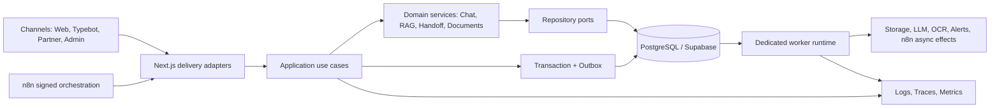

# KAXI 기술 아키텍처 고도화 PRD

Status: Implementation v1.6 — rollout fail-closed preflight까지 완료, production rollout/evaluation 승인 대기
작성일: 2026-08-13
대상 독자: 제품 오너, 테크 리드, 백엔드·프런트엔드·데이터/RAG·플랫폼 엔지니어, QA, 운영·보안 담당자
기준 코드: `main@4b9e210`을 기반으로 한 2026-08-13 로컬 워크트리 감사 결과
문서 역할: 기존 제품 PRD의 후속 기술 실행 문서. 제품 포지셔닝과 법적 역할 경계는 기존 문서를 계승한다.

---

## 0. Executive Summary

KAXI는 이미 PostgreSQL/Supabase 단일 운영 데이터베이스, pgvector 기반 검색, 승인형 지식 코퍼스, 서명된 n8n 연동, Typebot 채널, 개인정보 보호, durable attachment job, release gate를 갖춘 운영 가능한 모놀리스다. 따라서 다음 단계의 목표는 새로운 플랫폼이나 프레임워크를 추가하는 것이 아니라, 현재 시스템의 **정합성·경계·격리·관측 가능성**을 높이는 것이다.

현재 아키텍처의 상한선을 만드는 문제는 다음 여섯 가지다.

1. 채팅 메시지, 검색 기록, 필수 human handoff가 하나의 트랜잭션으로 커밋되지 않아 부분 성공이 가능하다.
2. Next.js Route Handler가 다른 Route Handler를 직접 호출해 HTTP 어댑터와 애플리케이션 정책이 결합돼 있다.
3. AI 스트림이 전체 답변 완료 후 텍스트를 나누는 방식이어서 실제 answer time-to-first-byte를 개선하지 못한다.
4. PDF, OCR, ONNX, 지식 모니터링 같은 무거운 작업이 웹 요청 런타임과 같은 배포·장애 영역을 공유한다.
5. 하나의 거대한 Client Component가 공개 화면 전체를 import해 라우트 수준 코드 스플리팅을 무력화한다.
6. API 계약, typed configuration, module boundary, request trace가 코드베이스 규모에 비해 표준화되지 않았다.

본 PRD의 목표 아키텍처는 **모듈러 모놀리스 + 별도 비동기 Worker**다.

- Next.js는 UI, 인증, 요청 검증, 응답 변환을 담당하는 delivery/control plane으로 유지한다.
- 도메인 실행은 프레임워크 독립적인 Application Use Case로 이동한다.
- 상태 변경은 PostgreSQL transaction과 transactional outbox를 기준으로 한다.
- OCR/PDF/임베딩/모니터링/outbox 전달은 별도 Worker runtime에서 실행한다.
- n8n은 서명 검증 후 KAXI 기능을 조합하는 channel/orchestration layer로 정의하며, 독립 RAG failover로 간주하지 않는다.
- 멀티테넌시는 두 번째 실제 파트너 조직의 운영 데이터가 들어오기 전에 완성한다.

전면 마이크로서비스 분리, 프레임워크 교체, 데이터베이스 재이전은 이 PRD의 목표가 아니다.

---

## 1. 배경과 현재 상태

### 1.1 보존해야 할 현재 자산

| 자산 | 현재 가치 | 본 PRD의 원칙 |
| --- | --- | --- |
| Supabase PostgreSQL + pgvector | 운영 데이터와 RAG serving의 단일 기준 | 유지한다. 트랜잭션 경계를 강화한다. |
| 승인·버전형 지식 코퍼스 | 공식 출처, 인용, freshness, review gate 보유 | 유지한다. retrieval stage를 명시적으로 버전 관리한다. |
| Signed n8n integration | 외부 orchestration에 대한 검증·replay 방어 | 유지한다. 독립 failover라는 표현만 제거한다. |
| Typebot + KAXI widget | 동일 gateway를 사용하는 다중 채널 | 채널 어댑터로 유지하고 도메인 실행을 공유한다. |
| 개인정보 암호화·보존·삭제 | 대화·첨부·handoff의 운영 보호 장치 | outbox와 Worker에도 동일 정책을 적용한다. |
| Durable attachment jobs | lease, retry, stale lock recovery 기반 | 별도 Worker 실행 단위로 승격한다. |
| 도메인 특화 CI gate | 인용, RAG, RLS, 프라이버시, handoff 회귀 방어 | 표준 runner와 리포팅을 추가하되 의미는 보존한다. |

### 1.2 2026-08-13 기술 기준선

| 항목 | 기준선 |
| --- | ---: |
| `src/` TypeScript/TSX 파일 | 428 |
| App Router Route Handler | 72 |
| Client Component | 121 |
| Prisma model | 45 |
| PostgreSQL migration | 59 |
| `scripts/test-*.ts` | 98 |
| `process.env` 직접 참조 파일 | 75 |
| `console.*` 호출 | 195 |
| `zod` 직접 import 파일 | 7 |
| Next instrumentation 파일 | 0 |
| W3C trace-context 구현 파일 | 0 |

로컬 프로덕션 빌드 산출물 기준:

| 영역 | 관측값 |
| --- | ---: |
| 공개 홈/Agent/진단/학교/비용/문서/파트너의 client-reference footprint | 각 20 chunks / 1,748.6 KiB raw JS |
| Guide 라우트 client-reference footprint | 8 chunks / 157.4 KiB raw JS |
| AI 함수 trace | 약 188.5~189.1 MiB uncompressed |
| 공식자료 monitor trace | 약 167.9 MiB uncompressed |
| Next standalone 산출물 | 약 332 MiB |

이 수치는 네트워크 압축 전 로컬 build trace이며 호스팅 업체의 최종 전송량 또는 과금량과 동일하지 않다. 본 PRD에서는 비교 기준선으로만 사용한다.

### 1.3 확인된 구조적 문제

| ID | 문제 | 현재 증거 | 사용자/운영 영향 |
| --- | --- | --- | --- |
| P-01 | 필수 상태의 부분 커밋 | 메시지 저장 후 retrieval, attachment link, handoff가 별도 호출 | handoff 필요 응답이 전달됐지만 운영 큐가 생성되지 않을 수 있음 |
| P-02 | HTTP adapter 간 결합 | `/api/ai/unified`가 Agent/Consult route를 import하고 synthetic request 생성 | 인증·rate limit·guardrail·오류 정책의 중복 또는 우회 위험 |
| P-03 | 후처리형 스트림 | 전체 JSON 응답 완료 후 answer를 chunk로 분할 | 사용자는 진행 애니메이션을 보지만 실제 답변 지연은 줄지 않음 |
| P-04 | 웹·배치 장애 영역 혼합 | PDF/ONNX native asset과 queue drain이 웹 함수에 포함 | 큰 배포물, 긴 cold start, timeout, 사용자 요청과 배치 간 자원 경쟁 |
| P-05 | Client graph 과결합 | `KaxiPage`가 모든 공개 화면과 Admin/Synonyms를 import | 불필요한 JS, hydration 비용, 변경 영향 범위 확대 |
| P-06 | 런타임 계약 분산 | 수동 body cast, 다수의 env 직접 참조, service-role 사용 분산 | 채널 계약 drift, 설정 오류, 보안 경계 감사 비용 증가 |
| P-07 | 운영 ledger와 trace의 단절 | ops event는 존재하지만 request/span context가 없음 | 한 요청의 n8n→RAG→LLM→DB 실패 원인을 연결하기 어려움 |
| P-08 | 테넌시의 암묵적 기본값 | 여러 운영 경로가 `tenant_id=default`를 사용하거나 다른 값을 거절 | 파트너 조직 확장 시 데이터 격리·키·RLS를 후행 수정해야 함 |

### 1.4 문제 정의

KAXI가 반환하는 “성공”은 현재 모든 필수 상태가 안전하게 커밋됐다는 의미로 일관되지 않다. 또한 같은 기능을 웹, Typebot, n8n, 내부 API가 서로 다른 HTTP 경로를 통해 재조합하면서 정책의 단일 기준이 Route 파일에 흩어져 있다.

따라서 본 PRD가 해결할 핵심 문제는 다음과 같다.

> KAXI의 모든 채널이 하나의 검증된 use case와 상태 전이 계약을 공유하고, 사용자 요청과 무거운 비동기 작업이 서로 다른 실행·장애 영역에서 동작하며, 성공·실패·재시도를 끝까지 추적할 수 있어야 한다.

---

## 2. 목표, 비목표, 성공 정의

### 2.1 목표

| ID | 목표 |
| --- | --- |
| G-01 | accepted chat turn은 메시지, 필수 retrieval 기록, 필수 handoff/outbox가 모두 커밋됐을 때만 성공으로 응답한다. |
| G-02 | Route Handler, Typebot, n8n이 프레임워크 독립적인 동일 Application Use Case를 호출한다. |
| G-03 | OCR/PDF/임베딩/monitor/outbox 전달을 별도 Worker runtime으로 격리한다. |
| G-04 | 공개 페이지가 라우트별 코드 스플리팅과 Server Component 기본 원칙을 따른다. |
| G-05 | 모든 외부 입력, 환경 설정, 오류 응답을 typed contract로 관리한다. |
| G-06 | request ID와 trace context로 사용자 요청에서 외부 provider와 persistence까지 연결한다. |
| G-07 | 두 번째 파트너 조직 운영 전 TenantContext, tenant-scoped key, RLS 검증을 완료한다. |
| G-08 | 기존 RAG 품질·인용·프라이버시·release gate를 약화시키지 않는다. |

### 2.2 비목표

- Next.js, Supabase/PostgreSQL, Prisma를 전면 교체하지 않는다.
- 모든 도메인을 독립 마이크로서비스로 분리하지 않는다.
- 본 PRD만으로 새로운 비자 유형, 결제, 수익 모델 또는 UI 리브랜딩을 출시하지 않는다.
- 기존 승인형 지식 정책, 법적 역할 경계, 개인정보 동의 정책을 완화하지 않는다.
- LLM 또는 embedding provider를 특정 업체 하나로 고정하지 않는다.
- n8n에 KAXI의 canonical persistence 또는 핵심 RAG 정책을 복제하지 않는다.
- 모든 기존 테스트를 한 번에 다른 test runner로 이식하지 않는다.

### 2.3 성공 정의

다음 조건을 모두 충족하면 본 PRD가 완료된 것으로 본다.

1. 필수 handoff 생성 실패 시 `persistenceAccepted=true`가 반환되는 경로가 없다.
2. `src/app/**/route.ts` 파일이 다른 Route Handler를 import하지 않는다.
3. 사용자 요청을 처리하는 Web/API 배포물에 PDF parser와 ONNX native runtime이 포함되지 않는다.
4. 공개 주요 라우트의 raw client-reference footprint가 기준선 대비 최소 60% 감소한다.
5. 외부 write endpoint의 요청 본문 100%가 공유 runtime schema로 검증된다.
6. 프로덕션 요청의 95% 이상이 request/trace ID로 Web→use case→DB/provider 구간을 연결한다.
7. Worker crash·중복 delivery·DB 일시 장애·storage promotion 중단 테스트에서 데이터 유실이 없다.
8. 기존 RAG 평가, 인용 무결성, high-risk recall, privacy/RLS gate가 모두 유지된다.

---

## 3. 이해관계자와 핵심 시나리오

### 3.1 이해관계자

| 이해관계자 | 필요한 결과 |
| --- | --- |
| 외국인 사용자 | 답변이 늦더라도 상태가 거짓 성공으로 표시되지 않고, 중복 요청에도 일관된 결과를 받음 |
| 파트너 행정사 | human handoff가 누락되지 않고, 조직 밖 데이터에 접근할 수 없음 |
| 운영자 | 한 요청의 검색·모델·persistence·alert 실패를 추적하고 재처리할 수 있음 |
| 개발팀 | 채널·프레임워크와 분리된 use case를 테스트하고 변경 영향 범위를 예측할 수 있음 |
| 보안·개인정보 담당 | service-role, tenant, PII, outbox payload의 사용 범위를 감사할 수 있음 |

### 3.2 핵심 시나리오

#### 시나리오 A: 정상 저위험 질문

1. 채널 어댑터가 principal, tenant, request identity를 확정한다.
2. Application Use Case가 mediation, retrieval, answer, guardrail을 수행한다.
3. 메시지와 retrieval run을 트랜잭션으로 저장한다.
4. 성공 응답과 trace ID를 반환한다.

#### 시나리오 B: Human handoff가 필요한 질문

1. 답변과 risk 판단이 완료된다.
2. 메시지, retrieval run, handoff task, 필요한 outbox event를 같은 트랜잭션으로 커밋한다.
3. 모두 성공한 경우에만 `persistenceAccepted=true`를 반환한다.
4. 알림 provider가 실패하더라도 outbox가 재시도하며 handoff task는 유지된다.

#### 시나리오 C: 첨부 업로드

1. Web은 quarantine object와 attachment/job metadata만 생성한다.
2. Worker가 job을 claim하고 MIME/security/OCR/PDF 처리를 수행한다.
3. Worker가 promotion saga를 통해 object와 DB pointer를 일치시킨다.
4. 중간에 Worker가 종료돼도 lease 만료 후 같은 job이 안전하게 재개된다.

#### 시나리오 D: n8n 경유 요청

1. n8n은 서명 검증과 channel orchestration을 수행한다.
2. n8n은 KAXI의 동일 Application Use Case를 호출한다.
3. provenance에는 orchestration path와 execution ID가 기록된다.
4. n8n 경유 성공은 독립 RAG failover 성공으로 집계하지 않는다.

---

## 4. 목표 아키텍처

### 4.1 논리 구조



### 4.2 계층별 책임

| 계층 | 책임 | 금지 |
| --- | --- | --- |
| Delivery adapter | 인증, tenant/principal 해석, schema 검증, HTTP/stream 변환 | 도메인 분기, 직접 다단계 persistence, 다른 route import |
| Application | use case orchestration, transaction 경계, idempotency, policy 순서 | NextRequest/NextResponse, browser API 의존 |
| Domain | risk, retrieval plan, handoff state, document state 규칙 | DB client, service-role key, HTTP response 의존 |
| Infrastructure | Prisma/Supabase repository, provider adapter, storage, outbox 구현 | 사용자 입력을 검증 없이 도메인에 전달 |
| Worker | queue/outbox consume, retry, DLQ, long-running 작업 | 공개 사용자 인증 endpoint 역할 |
| Presentation | Server Component 렌더링과 작은 Client island | 공개 라우트에서 Admin/unused feature import |

### 4.3 제안 모듈 경계

```text
src/
  app/                         # delivery adapters and route composition only
  modules/
    identity/
    chat/
    rag/
    handoff/
    documents/
    knowledge/
    operations/
      domain/
      application/
      infrastructure/
  server/
    config/
    context/
    observability/
  workers/
    attachments/
    knowledge-monitor/
    ingestion/
    outbox/
```

정확한 디렉터리 이동은 점진적으로 수행한다. 기능 동작 변경 없이 import boundary부터 도입하고, 기존 `src/lib` 모듈은 strangler 방식으로 이동한다.

### 4.4 의존성 규칙

1. `app`은 `application`을 호출할 수 있다.
2. `application`은 `domain`과 port interface를 사용할 수 있다.
3. `infrastructure`는 domain/application port를 구현할 수 있다.
4. `domain`은 `app`, Next.js, Prisma, Supabase SDK를 import할 수 없다.
5. Route Handler 간 import는 금지한다.
6. service-role client는 server-only infrastructure module에서만 생성한다.
7. Public presentation module은 Admin/Partner 운영 module을 import할 수 없다.
8. Worker와 Web은 동일 domain/application package를 사용할 수 있지만 entrypoint와 dependency trace는 분리한다.

---

## 5. 상세 제품·기술 요구사항

### 5.1 FR-01 — 원자적 대화·검색·Handoff 계약

#### 요구사항

1. accepted chat turn의 unit of work는 다음을 포함한다.
   - canonical chat message
   - 완료된 답변의 retrieval run
   - 첨부-message link
   - `needsHuman=true`일 때 canonical handoff task
   - 비동기 후속 작업을 위한 outbox event
2. 위 필수 데이터는 하나의 PostgreSQL transaction 또는 동일 원자성을 보장하는 database function으로 커밋한다.
3. `persistenceAccepted=true`는 모든 필수 데이터가 커밋된 경우에만 반환한다.
4. 필수 handoff 실패를 best-effort로 삼키지 않는다.
5. 알림, 이메일, n8n audit 전달처럼 외부 시스템에 대한 side effect는 business transaction과 분리하고 outbox로 전달한다.
6. 모든 write는 request/idempotency key에 대해 재실행 가능해야 한다.
7. 이미 완료된 동일 요청은 같은 canonical 결과를 반환하고 중복 handoff/outbox를 만들지 않는다.
8. transaction 실패 시 사용자에게 안정적인 machine-readable error code와 동일 request ID를 반환한다.

#### Outbox 최소 데이터

| 필드 | 설명 |
| --- | --- |
| id | 전역 event ID |
| tenantId | tenant scope |
| aggregateType / aggregateId | chat, handoff, document 등 원본 |
| eventType | `handoff.created`, `alert.requested` 등 |
| idempotencyKey | 중복 전달 방지 키 |
| payload | 최소화·암호화 또는 redacted 데이터 |
| traceId | 요청 trace 연결 |
| status / attempts / availableAt | retry 상태 |
| lockedAt / lockToken | leased claim |
| createdAt / processedAt | 감사·SLA |

#### 수용 기준

- AC-01.1: handoff insert를 강제로 실패시키면 응답의 `persistenceAccepted`와 `handoffTaskPersisted`가 모두 false다.
- AC-01.2: message insert 후 retrieval insert가 실패하면 부분 message가 남지 않거나 명시적인 recoverable 상태로만 남는다.
- AC-01.3: 같은 idempotency key를 10회 병렬 전송해도 canonical message, open handoff, outbox event는 각각 하나다.
- AC-01.4: alert provider가 30분 중단돼도 handoff는 즉시 운영 큐에 보이고, 복구 후 outbox가 전달된다.
- AC-01.5: payload에는 평문 PII가 저장되지 않으며 기존 retention/deletion이 outbox에도 적용된다.

### 5.2 FR-02 — Application Use Case와 HTTP Adapter 분리

#### 요구사항

1. Unified AI, Agent, Consult, Typebot RAG, n8n RAG가 공유할 use case interface를 정의한다.
2. use case input은 다음 context를 명시적으로 받는다.
   - `requestId`
   - `idempotencyKey`
   - authenticated principal 또는 anonymous session principal
   - `tenantId`
   - locale/channel
   - cancellation/deadline
3. use case output은 HTTP 타입이 아닌 typed domain/application result다.
4. 인증, body size, schema validation, cache/stream header는 adapter가 담당한다.
5. mediation, retrieval, answer generation, guardrail, persistence 순서는 Application layer의 단일 정책으로 유지한다.
6. Route Handler가 다른 Route Handler를 직접 import하거나 synthetic `NextRequest`를 생성하지 않는다.
7. n8n internal route도 동일 use case를 호출하되 signed receipt 검증은 adapter에 남긴다.
8. Architecture lint 또는 fitness test로 금지 import를 CI에서 차단한다.

#### 수용 기준

- AC-02.1: `rg`/architecture test 기준 Route Handler 간 import가 0건이다.
- AC-02.2: 동일 fixture를 Web, Typebot, n8n adapter로 호출했을 때 risk, sources, persistence contract가 동일하다.
- AC-02.3: Application unit test가 Next.js runtime 없이 실행된다.
- AC-02.4: rate limit과 guardrail이 각 요청에서 정확히 한 번 적용됐음을 trace로 확인할 수 있다.

### 5.3 FR-03 — 실제 단계 기반 스트리밍

#### 요구사항

1. 스트림 protocol은 versioned NDJSON 또는 동등한 typed event contract를 사용한다.
2. 지원 event는 최소 `progress`, `delta`, `complete`, `error`다.
3. `routing`, `searching`, `generating`, `finalizing` progress는 실제 stage 진입 시점에만 발생한다.
4. 전체 answer 완료 후 인위적으로 sleep하며 나누는 post-processing delta는 제거한다.
5. 안전성 정책에 따라 두 모드를 지원한다.
   - `progress-only`: 검증 전 content는 노출하지 않고 complete에서 최종 답변 전달
   - `verified-delta`: 검증 가능한 단위만 점진 전달
6. request abort와 deadline을 provider 및 retrieval 작업까지 전파한다.
7. complete 또는 terminal error는 정확히 한 번 발생한다.
8. 기존 non-stream JSON endpoint는 호환 기간 동안 유지한다.

#### 수용 기준

- AC-03.1: progress event timestamp가 실제 stage span 시작 시각과 일치한다.
- AC-03.2: `verified-delta` 모드에서는 use case 전체 완료 전에 첫 delta가 도착한다.
- AC-03.3: `progress-only` 모드에서는 검증되지 않은 answer token이 전송되지 않는다.
- AC-03.4: client abort 후 provider 호출과 DB 후속 write가 정책에 맞게 취소되거나 안전하게 완료된다.
- AC-03.5: 구버전 client가 stream negotiation 실패 시 JSON endpoint로 fallback한다.

### 5.4 FR-04 — Dedicated Worker Runtime

#### Worker 범위

- attachment MIME/security/OCR/PDF extraction과 storage promotion
- official-source monitor와 candidate 생성
- embedding/RAG ingestion
- outbox delivery와 retry
- 장시간 batch/reconciliation

#### 요구사항

1. Web/API는 enqueue, status 조회, 관리 명령만 담당하고 heavy job 본체를 실행하지 않는다.
2. Worker는 at-least-once delivery를 전제로 idempotent하게 동작한다.
3. queue는 lease, heartbeat, exponential backoff, max attempt, dead-letter 상태를 지원한다.
4. job별 timeout과 전체 batch deadline을 구분한다.
5. source monitor는 source별 durable cursor와 run ledger를 보유한다.
6. 첨부 promotion은 다음과 같은 복구 가능한 saga를 사용한다.
   - quarantine verified
   - extraction completed
   - promotion planned
   - object moved/copied
   - DB pointer committed
   - ready
7. object 이동과 DB pointer 사이에서 실패하면 reconciler가 destination/source를 확인해 수렴시킨다.
8. Worker dependency trace는 Web 배포물과 분리한다.
9. 기존 GitHub scheduler는 초기에는 recovery trigger로 유지할 수 있으나 유일한 worker trigger가 되어서는 안 된다.
10. Worker 플랫폼은 durable execution, secret isolation, regional/network 접근, 비용을 비교해 ADR로 선택한다.

#### 수용 기준

- AC-04.1: OCR 도중 Worker process를 강제 종료해도 lease 만료 후 job이 재개되고 중복 extraction row를 만들지 않는다.
- AC-04.2: storage move 직후 DB 장애를 주입해도 15분 이내 reconciler가 object와 pointer를 일치시킨다.
- AC-04.3: queue backlog와 oldest-job age가 metric으로 노출되고 임계값에서 alert가 발생한다.
- AC-04.4: Web/API trace에서 PDF parser와 ONNX native asset이 제거된다.
- AC-04.5: source monitor 중단 후 마지막 완료 source 다음부터 재개된다.

### 5.5 FR-05 — Next.js Server/Client Boundary와 Bundle Budget

#### 요구사항

1. 각 공개 route가 해당 feature component를 직접 import한다.
2. 공통 header/footer/legal shell은 Server Component를 기본으로 한다.
3. locale switch, calculator, form, chat처럼 상호작용이 필요한 부분만 Client island로 둔다.
4. Public route graph에서 Admin, Synonyms, 사용하지 않는 feature import를 제거한다.
5. `KaxiPage`는 제거하거나 Server shell 수준으로 축소한다.
6. Admin 초기 조회는 가능한 경우 Server Component에서 인증 후 repository/application query를 직접 호출한다.
7. Client Component가 mount 후 내부 API를 다시 호출하는 초기 waterfall은 점진적으로 제거한다.
8. build마다 주요 route client-reference footprint를 측정하고 budget regression을 CI에 보고한다.

#### Bundle budget

| 항목 | 목표 |
| --- | --- |
| 주요 공개 route raw client-reference footprint | 기준선 대비 60% 이상 감소 |
| 공개 route에 포함된 Admin/Synonyms 전용 chunk | 0 |
| 신규 Client Component | browser API/state 필요성 문서화 |
| budget 초과 | PR gate 실패 또는 명시적 waiver |

#### 수용 기준

- AC-05.1: 홈, Agent, 진단, 학교, 비용, 문서, 파트너 route가 더 이상 동일한 전체 chunk set을 공유하지 않는다.
- AC-05.2: 학교 route 변경이 Agent/Admin client chunk hash를 변경하지 않는다.
- AC-05.3: SSR HTML에 주요 콘텐츠와 loading 이전의 접근 가능한 기본 구조가 포함된다.
- AC-05.4: 모바일·데스크톱 기존 navigation과 locale 동작이 유지된다.

### 5.6 FR-06 — Contract-first API와 Typed Configuration

#### 요구사항

1. 모든 외부 write endpoint는 공유 runtime schema로 body, query, path parameter를 검증한다.
2. body size cap은 parsing 전에 적용하고 streaming body에도 상한을 둔다.
3. 표준 오류 envelope를 사용한다.

```json
{
  "error": {
    "code": "HANDOFF_PERSISTENCE_FAILED",
    "message": "요청을 안전하게 저장하지 못했습니다.",
    "requestId": "req_...",
    "retryable": true,
    "issues": []
  }
}
```

4. 오류 message는 PII 또는 원문 payload를 반사하지 않는다.
5. Typebot/n8n/partner contract는 동일 schema에서 fixture/type을 생성하거나 검증한다.
6. server runtime env는 하나의 typed config boundary에서 시작 시 검증한다.
7. public env, build-time env, runtime secret을 구분한다.
8. Application/Domain code는 `process.env`를 직접 읽지 않고 주입된 config/capability를 사용한다.
9. service-role key는 server-only infrastructure adapter 외부에서 참조할 수 없다.
10. 사용 중인 env와 readiness capability가 같은 config source를 사용한다.

#### 수용 기준

- AC-06.1: 외부 write endpoint schema coverage가 100%다.
- AC-06.2: malformed, oversized, unknown-field payload에 대해 일관된 4xx와 request ID를 반환한다.
- AC-06.3: 필수 production config 누락은 첫 사용자 요청이 아니라 startup/readiness에서 탐지된다.
- AC-06.4: CI scan 기준 Application/Domain의 직접 `process.env`와 service-role 참조가 0건이다.

### 5.7 FR-07 — Observability, Trace, SLO

#### 요구사항

1. Next instrumentation entrypoint에서 server error와 tracing provider를 등록한다.
2. 모든 request에 request ID를 부여하고 유효한 inbound ID/trace context만 계승한다.
3. W3C `traceparent`를 n8n, Worker, provider adapter에 전파한다.
4. 로그는 구조화 JSON이며 secret, token, raw PII를 redaction한다.
5. 최소 span:
   - request/auth/rate-limit
   - mediation
   - retrieval lexical/vector/rerank
   - answer provider attempt
   - guardrail
   - transaction
   - outbox enqueue/delivery
   - Worker claim/process/promotion
6. 기존 workflow/model/prompt/execution provenance를 span attribute와 canonical ledger에 연결한다.
7. RED metric(rate, error, duration)과 queue metric(depth, age, retry, DLQ)을 제공한다.
8. 사용자-facing 오류 응답과 운영 event가 같은 request/trace ID를 공유한다.
9. critical alert는 n8n 자체 장애와 무관한 채널을 최소 하나 유지한다.

#### 수용 기준

- AC-07.1: 표본 production request의 95% 이상이 Web부터 persistence/provider까지 연결된다.
- AC-07.2: raw question, answer, contact, token이 log/trace attribute에 저장되지 않는다.
- AC-07.3: 한 request ID로 사용자 오류, provider attempt, transaction 결과, outbox 상태를 조회할 수 있다.
- AC-07.4: tracing backend 장애가 사용자 요청을 실패시키지 않는다.

### 5.8 FR-08 — First-class TenantContext

#### 활성 조건

두 번째 파트너 조직의 production data를 저장하기 전 본 요구사항을 완료해야 한다. 단일 tenant 운영 기간에는 기존 `default`를 명시적인 platform tenant record에 매핑할 수 있다.

#### 요구사항

1. TenantContext는 인증 세션, signed channel claim 또는 trusted organization assignment에서만 파생한다.
2. 일반 request body의 `tenantId`를 권한 근거로 사용하지 않는다.
3. 모든 tenant-owned aggregate와 idempotency/uniqueness key는 tenant scope를 포함한다.
4. RLS와 repository query가 같은 tenant semantics를 사용한다.
5. service-role operation도 명시적 TenantContext 없이는 tenant-owned row를 읽거나 쓰지 못하도록 application guard를 둔다.
6. `tenant_id=default` hard-code를 compatibility resolver로 대체하고 신규 코드에서 금지한다.
7. cross-tenant access, guessed ID, duplicate idempotency key에 대한 negative test를 제공한다.
8. tenant별 retention, export, deletion 범위를 검증한다.

#### 수용 기준

- AC-08.1: Tenant A 사용자가 Tenant B의 message, attachment, case, handoff를 읽거나 변경할 수 없다.
- AC-08.2: 동일 idempotency key가 서로 다른 tenant에서 독립적으로 동작한다.
- AC-08.3: internal n8n/Worker 경로도 signed tenant claim 없이 tenant-owned 작업을 실행하지 않는다.
- AC-08.4: production query/log 표본에서 암묵적 `default` 신규 write가 0건이다.

### 5.9 FR-09 — Versioned Retrieval Pipeline

#### 요구사항

1. retrieval을 다음 명시적 stage로 모델링한다.
   - governance filter
   - query expansion/mediation
   - lexical/vector candidate retrieval
   - fusion
   - rerank
   - confidence/no-context decision
   - citation selection
2. SQL과 TypeScript에 분산된 각 stage의 책임과 순서를 하나의 `RetrievalPlan` version으로 기록한다.
3. 모든 retrieval run은 plan version, score version, threshold set, embedding source, candidate count를 저장한다.
4. 같은 query/fixture에 대한 deterministic replay를 지원한다.
5. 이전 SQL RPC/version은 호환 창과 shadow evaluation 후 제거한다.
6. 새 scoring 변경은 locale/category별 평가와 high-risk/no-context gate를 통과해야 한다.

#### 수용 기준

- AC-09.1: production answer마다 사용된 retrieval plan과 threshold를 재현할 수 있다.
- AC-09.2: 동일 corpus snapshot과 plan으로 replay한 candidate order가 허용 오차 내에서 일치한다.
- AC-09.3: 사용되지 않는 legacy RPC와 score version은 deprecation 목록과 제거일을 가진다.

### 5.10 FR-10 — 테스트·CI·Architecture Fitness

#### 요구사항

1. 기존 도메인 테스트 의미와 release gate를 보존한다.
2. test manifest를 types/domain/ops/integration/e2e/performance suite로 명시적으로 관리한다.
3. Application/Domain unit test는 표준 runner와 JUnit-compatible report를 제공한다.
4. 독립 suite는 CI에서 병렬 실행하고 실패 결과를 개별 artifact로 남긴다.
5. 다음 architecture fitness rule을 CI에 추가한다.
   - route-to-route import 금지
   - domain의 Next/Prisma/Supabase import 금지
   - public-to-admin import 금지
   - service-role 참조 위치 제한
   - external endpoint schema coverage
6. 다음 failure-injection test를 추가한다.
   - handoff insert 실패
   - retrieval insert 실패
   - outbox provider 실패와 중복 delivery
   - Worker crash/stale lease
   - storage move와 DB update 사이 실패
   - n8n/provider timeout
   - tenant crossing
7. bundle/trace size를 build artifact로 저장하고 기준선과 비교한다.
8. test runner 전환은 점진적으로 수행하며 한 번에 모든 스크립트를 재작성하지 않는다.

#### 수용 기준

- AC-10.1: 모든 architecture fitness rule이 merge gate다.
- AC-10.2: failure-injection suite가 preview 환경에서 통과한다.
- AC-10.3: 기존 RAG, citation, privacy, RLS, handoff 평가가 regression 없이 통과한다.
- AC-10.4: CI에서 어떤 test가 누락됐는지 자동으로 탐지한다.

---

## 6. 비기능 요구사항

### 6.1 신뢰성·정합성

| 항목 | 목표 |
| --- | --- |
| accepted turn canonical persistence | 월 99.9% 이상 |
| accepted human handoff 누락 | 0 |
| duplicate open handoff | 0 |
| outbox event 최종 전달 | 99.9% 이상, provider 장기 장애 제외 |
| orphaned storage object/pointer | 자동 수렴, 15분 초과 0 |
| Worker job 유실 | 0 |

### 6.2 성능

| 항목 | 초기 목표 |
| --- | --- |
| 첫 progress event | p95 ≤ 500ms |
| verified answer 또는 complete | 기존 production p95 대비 10% 이상 악화 금지 |
| 주요 공개 route client footprint | 기준선 대비 60% 이상 감소 |
| attachment queue start latency | p95 ≤ 10s |
| 지원 형식 attachment 처리 | p95 ≤ 30s, 대형 PDF 별도 budget |
| API adapter overhead | use case 제외 p95 ≤ 100ms |

성능 목표는 preview load test와 production baseline을 재측정한 뒤 release gate 수치로 확정한다.

### 6.3 보안·개인정보

- service-role secret은 server-only infrastructure와 Worker secret store에서만 사용한다.
- log, trace, outbox payload는 data classification과 redaction 정책을 따른다.
- signed URL, HMAC, nonce/replay, body size, rate limit 정책을 유지한다.
- tenant-owned operation은 principal과 TenantContext를 모두 요구한다.
- Worker도 기존 retention, deletion, consent scope를 준수한다.
- 외부 provider로 전달되는 데이터는 최소화하고 provider별 국외이전/보존 정책을 따른다.

### 6.4 운영성

- 모든 queue와 outbox는 depth, oldest age, retry, DLQ dashboard를 제공한다.
- 운영자는 code deploy 없이 안전한 replay 또는 terminal close를 수행할 수 있다.
- replay는 감사 event와 operator identity를 남긴다.
- 각 단계에는 rollback runbook과 데이터 reconciliation runbook이 있어야 한다.
- readiness는 DB 연결뿐 아니라 schema, queue/outbox capability, required provider 상태를 구분해 보고한다.

---

## 7. 데이터·계약 변경

### 7.1 예상 신규/변경 데이터

| 대상 | 변경 |
| --- | --- |
| OutboxEvent | transactional side-effect ledger 추가 |
| ChatMessage/RetrievalRun/HandoffTask | 하나의 DB unit-of-work로 저장할 RPC/repository 도입 |
| ChatAttachment | promotion state, planned destination key, reconciliation metadata 추가 |
| AttachmentJob | heartbeat, terminal reason, DLQ/replay metadata 보강 |
| MonitorRun/MonitorCursor | source별 run ledger와 checkpoint 추가 |
| Tenant | `default`를 대체할 명시적 platform tenant와 organization mapping |
| RetrievalRun | retrieval plan/threshold/embedding/fusion/rerank version 기록 강화 |

정확한 schema는 구현 전 ADR과 migration review에서 확정한다. 신규 migration은 backward-compatible expand → backfill → switch → contract 순서를 따른다.

### 7.2 API 호환성

- 기존 JSON endpoint는 새 use case를 호출하도록 내부 구현만 교체한다.
- 필드 제거는 최소 한 번의 deprecation window와 usage telemetry 후 수행한다.
- stream contract는 `X-KAXI-Stream-Version` 또는 content negotiation으로 버전 관리한다.
- Typebot/n8n mapping은 fixture test와 published workflow 검증을 동시에 통과해야 한다.
- 표준 오류 envelope 전환 중 기존 top-level `error`가 필요한 client에는 compatibility adapter를 제공한다.

### 7.3 Event delivery semantics

- queue/outbox는 exactly-once transport를 가정하지 않는다.
- consumer는 at-least-once delivery와 idempotency key를 전제로 한다.
- 순서가 필요한 aggregate는 aggregate sequence 또는 DB state check로 보호한다.
- event payload는 source of truth가 아니라 처리 지시와 최소 snapshot이다.
- canonical row가 삭제되면 retention 정책에 따라 pending event를 cancel 또는 redact한다.

---

## 8. 단계별 실행 계획

추정은 2~3명의 엔지니어가 2주 sprint로 병행한다는 가정이다. 실제 일정은 Worker 플랫폼과 DB transaction 구현 방식 결정 후 확정한다.

### Phase 0 — 즉시 정합성 안전화

목표: 현재 계약 위반을 제거하고 이후 리팩토링의 안전망을 만든다.

- [x] handoff 실패 시 `persistenceAccepted=true`가 되지 않도록 수정
- [x] handoff/persistence failure-injection regression test 추가
- [x] route-to-route, public-to-admin import 기준선 test 추가
- [x] bundle/trace 측정 스크립트와 기준선 artifact 고정
- [x] ADR-001 모듈러 모놀리스 + Worker 원칙 승인
- [x] ADR-002 n8n 역할을 orchestration/retry로 명시

구현 상태: **완료 (2026-08-13)**

- `persistRequiredChatState`가 canonical write와 필수 handoff acceptance 계약을 한 곳에서 강제한다.
- CI는 기존 route-to-route 3건과 public-to-admin 1건만 한시적으로 허용하며 새 경계 위반을 거절한다.
- `quality/architecture-baseline.json`과 build 후 size gate가 client/server trace 증가를 감시한다.
- ADR-0001과 ADR-0002가 목표 실행 경계와 n8n의 비독립 failover 의미를 고정한다.

Exit:

- 거짓 persistence 성공 0
- 기존 CI/build/RAG/privacy gate 통과
- architecture baseline이 자동 측정됨

### Phase 1 — Use Case와 Transaction/Outbox

목표: 채널과 persistence의 단일 실행 계약을 만든다.

- [x] Unified AI/Agent/Consult application service 추출
- [x] Typebot/n8n adapter를 동일 use case에 연결
- [x] chat/retrieval/handoff atomic DB operation 구현
- [x] OutboxEvent와 idempotent consumer 기반 구현
- [x] service-role client를 infrastructure boundary로 이동
- [x] 표준 request context와 error envelope 도입

구현 상태: **완료 (2026-08-13)**

- `src/application/ai`가 Action, Expert, Unified 실행 정책과 typed result를 소유한다.
- HTTP body/rate/quota/session/status 변환은 `src/adapters/http/ai`에 남겼다.
- Route Handler 간 직접 import는 3건에서 0건으로 감소했다.
- application runtime import closure 79개가 Next.js와 HTTP adapter에 의존하지 않음을 CI에서 검증한다.
- Typebot과 signed n8n runtime은 `runRagAnswerUseCase`의 retrieval, generation, risk review, guardrail 계약을 공유한다.
- Prisma transaction이 chat, retrieval, attachment link, required handoff, PII-minimized outbox를 한 번에 커밋한다.
- PostgreSQL advisory lock과 unique key로 동일 idempotency key의 10-way 병렬 재시도를 하나의 canonical 결과로 수렴시킨다.
- Outbox consumer는 `SKIP LOCKED` lease, stable delivery key, exponential retry와 dead-letter 상태를 사용한다.
- canonical message 삭제 시 연결된 outbox가 cascade되고, retention sweeper가 만료 event만 삭제하며 fresh event는 보존하는 회귀 테스트를 통과했다.
- service-role Supabase client factory는 `src/infrastructure/supabase` 한 곳으로 제한되고 CI fitness test가 이를 강제한다.
- ADR-0004가 Prisma transaction 선택, rollback/idempotency 및 at-least-once outbox 의미를 고정한다.

Exit:

- Route Handler 간 import 0
- accepted human handoff 누락 0
- provider 장애와 무관하게 outbox가 재시도됨
- Web/Typebot/n8n contract parity 통과

### Phase 2 — Worker 격리와 Observability

목표: heavy workload를 요청 runtime에서 분리하고 end-to-end 추적을 만든다.

- [ ] Worker 플랫폼 ADR 승인 및 최소 runtime 배포 (ADR·컨테이너 완료, production 배포 승인 대기)
- [x] attachment processing/promotion saga 이전
- [x] outbox delivery 이전
- [x] official-source monitor cursor/run ledger 이전
- [x] ingestion/embedding job 이전
- [x] instrumentation, structured logger, trace propagation 도입
- [x] queue/trace/SLO dashboard와 alert 연결

구현 상태: **로컬 구현·회귀 검증 완료, production rollout gate 대기 (2026-08-13)**

- ADR-0005가 Railway Bun container, PostgreSQL leased queue, GitHub recovery trigger 역할을 확정한다.
- `worker_jobs`는 idempotency, heartbeat lease, deadline, retry/DLQ를 제공하고 `worker_source_checkpoints`가 source 단위 재개 지점을 보존한다.
- attachment 추출은 Worker만 실행하며 object move와 DB pointer commit 사이의 장애는 promotion ledger와 reconciler로 수렴한다.
- official-source monitor, serving ingestion/sync, embedding, document OCR/verification, system health 및 outbox delivery가 Web 요청에서 enqueue-only 계약으로 전환됐다.
- `src/instrumentation.ts`, W3C `traceparent`, PII-safe structured log와 `trace_spans` 원장이 Web·Worker 구간을 request/trace ID로 조회 가능하게 한다.
- Web AI stage, canonical chat transaction, outbox, Worker와 attachment queue가 같은 필수 `requestId`/`traceId`/`traceparent`를 보존한다. correlation migration은 기존 in-flight row를 backfill한 뒤 NOT NULL을 강제한다.
- Web AI HTTP adapter는 body 처리 전 유효한 request/trace identity를 확정하고 `ai.request` 아래 rate-limit, validation, auth, provider/guardrail/persistence stage를 연결한다. 유효하지 않은 inbound request ID는 재발급하며 모든 성공·4xx·5xx 응답 본문/헤더가 동일 correlation ID를 반환한다.
- Typebot/KAXI RAG gateway도 rate-limit과 signed gateway/session/attachment ownership 인증을 `rag.rate_limit`·`rag.auth` span으로 기록하고 이후 mediation·retrieval/generation·guardrail·transaction과 같은 W3C trace를 사용한다.
- canonical direct RAG는 embedding, tenant-scoped lexical+vector RPC, deterministic rerank, answer provider attempt를 각각 `rag.retrieval.vector_embedding`, `rag.retrieval.lexical_vector`, `rag.retrieval.rerank`, `rag.answer_provider_attempt`로 측정한다.
- tracing exporter 장애는 구조화 경고로 격리되어 사용자 요청을 실패시키지 않는 fail-open 회귀 테스트를 통과했다.
- production trace gate는 canonical/Worker/outbox/attachment 단위를 분모에서 누락하지 않고 request+trace exact match와 필수 span group을 검증한다. request ID가 없는 span도 PII attribute scan에서 제외하지 않는다.
- Admin Ops와 Worker `/metrics`가 queue depth, oldest age, retry, DLQ를 노출하고 threshold 위반은 기존 Ops alert 채널로 연결된다.
- Admin Ops의 owner 전용 replay가 Worker/outbox/attachment terminal failure를 compare-and-set으로 재등록하고 새 tenant claim, stable idempotency key, PII-safe audit evidence를 보존한다. 운영 절차는 `docs/runbooks/worker-replay-and-reconciliation.md`로 고정하고 로컬 PostgreSQL rehearsal을 통과했다.
- architecture fitness test가 Web runtime import closure 391개에서 PDF/ONNX/Worker-heavy module 유입을 거절한다.
- production Worker 배포, 실제 Next build trace scan 및 production sample trace coverage 95% 검증은 rollout 승인 후 수행한다.

Exit:

- Web/API dependency trace에서 PDF/ONNX 제거
- Worker kill/retry/reconciliation test 통과
- trace coverage 95% 이상
- GitHub cron은 recovery trigger로만 남음

### Phase 3 — Delivery Surface 최적화

목표: Next.js Server/Client 경계를 복구하고 실제 진행/스트리밍 경험을 제공한다.

- [x] 공개 route별 feature import로 `KaxiPage` 분해
- [x] Server route composition + Client `PublicShell` island 도입
- [x] Admin 초기 data waterfall을 server read로 전환
- [x] 실제 stage event와 progress-only/verified-delta stream 구현
- [x] client compatibility와 abort/retry UX 검증
- [x] bundle budget merge gate 적용

구현 상태: **완료 (2026-08-13)**

- 공개 Server route가 Landing, Agent, Diagnosis, Schools, Cost, Documents, Partners를 직접 조합하며 `KaxiPage`와 public→Admin import edge를 제거했다.
- 공통 Header/footer/navigation만 `PublicShell` Client island에 남고 기능별 client graph는 라우트 단위로 분리된다.
- 공개 Header 로그아웃은 서버 session endpoint를 사용해 모든 공개 라우트에 포함되던 Supabase browser SDK를 제거했다.
- 주요 공개 라우트 raw client-reference footprint는 1,790,570 bytes 기준선에서 455,683~505,683 bytes로 감소해 71.8~74.5% 절감됐다.
- merge gate는 주요 공개 라우트가 원 기준선의 40%를 초과하면 실패한다.
- stream contract v2는 Application의 실제 routing/searching/generating/finalizing 진입에서 progress를 발생시키고, progress-only 모드에서 guardrail 완료 전 answer token을 보내지 않는다.
- fake post-processing delta와 sleep replay는 제거됐으며 inactivity/total watchdog, abort, retryable terminal error test가 유지된다.
- Admin auth와 Ops뿐 아니라 Cases/Case detail, Rules, Audit, Analytics, Handoffs, Documents, Knowledge, Leads가 인증된 server query 결과를 `initialData`로 렌더링하며 mount 직후 동일 API를 재호출하지 않는다.
- verified-delta는 검색·도구 실행으로 검증된 근거가 존재하는 시점에만 전달되고, 완료·guardrail 전에 임의 answer token을 재생하지 않는다.

Exit:

- 공개 route bundle 기준선 대비 60% 이상 감소
- Admin/Synonyms chunk의 공개 route 유입 0
- post-processing fake delta 0
- 접근성·locale·navigation E2E 통과

### Phase 4 — Scale Readiness

목표: 파트너 확장과 RAG 실험을 안전하게 만든다.

- [x] TenantContext와 platform tenant migration
- [x] tenant-scoped uniqueness, repository, RLS test
- [x] `tenant_id=default` hard-code 제거
- [x] RetrievalPlan과 scoring version 통합
- [x] legacy retrieval RPC/version deprecation
- [x] 표준 test runner/reporting과 CI 병렬화 확대
- [x] backup/restore와 disaster recovery rehearsal

구현 상태: **로컬 구현·격리/복구 검증 완료, production 데이터 관찰 gate 대기 (2026-08-13)**

- 명시적 `platform` tenant와 Organization 연결, tenant-scoped composite key/FK 및 RLS가 추가됐고 신뢰 가능한 생성자만 `TenantContext`를 만들 수 있다.
- Worker/n8n tenant claim은 audience·subject·만료가 서명되며, 두 tenant의 동일 외부 ID와 idempotency key가 독립적으로 동작한다.
- retrieval plan은 stage, score/threshold, embedding source, candidate count, corpus snapshot, replay spec을 버전과 함께 저장한다.
- tenant 필수 lexical/hybrid RPC가 신규 버전으로 도입됐고 legacy RPC 제거 기한은 `docs/retrieval-rpc-lifecycle.json`에 기록됐다.
- 119개 `test:*` script가 6개 표준 suite에 전수 배정되고 CI가 독립 PostgreSQL job, JUnit/log/trace artifact를 병렬 생성한다.
- 모든 `src/` 런타임 설정은 `runtime-environment` 또는 정적 치환이 필요한 `build-environment` 두 typed raw-env boundary에서만 시작한다. architecture fitness는 그 밖의 직접 `process.env`를 0건으로 강제하고 82개 Client root의 의존 그래프가 server runtime/secret boundary에 도달하지 못하게 한다.
- public build key, deployment build key, runtime secret key는 서로 분리된 목록과 타입을 사용한다. Supabase 공개 키는 단일 build boundary의 literal `NEXT_PUBLIC_*` 참조로 Next.js 정적 치환을 보존하며 service-role·DB·signing·provider·alert credential은 runtime secret으로 분류한다.
- AI adapter의 rate/quota/length/deadline은 `application-ai-config`에서 파싱한다. readiness·instrumentation startup·실제 adapter는 같은 raw config source를 사용하고, production의 잘못된 정수/boolean 설정은 첫 요청 전에 거절된다. Web trace ID 생성은 Web Crypto를 사용해 Edge instrumentation에 Node `crypto`가 유입되지 않는다.
- 격리된 `_test` 데이터베이스의 custom-format backup을 새 DB에 복구해 tenant sentinel과 당시 65개 migration history를 확인했다. 이후 request/trace correlation migration을 포함한 현재 66개 migration의 fresh reset도 통과했다.

Exit:

- 두 tenant 간 cross-access negative test 100% 통과
- production 신규 implicit default write 0
- retrieval replay 가능
- restore rehearsal와 load/failure test 통과

---

## 9. Rollout 및 Rollback 전략

### 9.1 Rollout 원칙

1. 큰 재작성 대신 branch-by-abstraction을 사용한다.
2. 먼저 interface와 adapter를 추가하고 기존 구현을 그 뒤에 연결한다.
3. 새 use case는 동일 fixture에 대해 기존 결과와 shadow 비교한다.
4. persistence 전환은 expand migration 후 새 transaction path를 canary로 활성화한다.
5. outbox는 중복 외부 전송을 막기 위해 idempotency를 먼저 배포한 뒤 producer를 전환한다.
6. Worker는 한 job type씩 이전하고 기존 drain은 recovery path로 유지한다.
7. frontend route는 locale별·view별로 점진 전환한다.
8. 시간 제한 feature flag는 rollout 종료 후 제거한다.

### 9.2 Rollback 조건

다음 중 하나라도 발생하면 해당 phase rollout을 중단한다.

- accepted turn persistence가 99.9% 아래로 하락
- duplicate handoff 또는 cross-tenant 접근 발생
- RAG citation/high-risk gate 실패
- queue oldest age가 SLO를 지속 초과
- bundle 또는 latency가 승인 budget을 초과
- trace/log에서 PII 또는 secret 노출 발견

### 9.3 Rollback 방법

- Application adapter는 호환 기간 동안 이전 implementation으로 되돌릴 수 있어야 한다.
- DB migration은 destructive rollback 대신 새 column/table을 유지하고 read/write path를 되돌린다.
- outbox consumer는 중지해도 canonical transaction을 손상시키지 않는다.
- Worker 전환 실패 시 enqueue를 유지하고 검증된 이전 drain이 backlog를 처리한다.
- frontend는 route별 flag 또는 revert로 독립 복구한다.
- tenant enforcement는 데이터 backfill과 RLS 검증 없이 비활성화하지 않는다.

---

## 10. 검증·릴리스 게이트

### Gate A — 정합성

- [x] required handoff failure test
- [x] transaction rollback test
- [x] parallel idempotency test
- [x] outbox duplicate/retry test
- [x] attachment promotion reconciliation test

### Gate B — 아키텍처 경계

- [x] route-to-route import 0
- [x] domain framework import 0
- [x] public-to-admin import 0
- [x] service-role allowlist 통과
- [x] external write schema coverage 100%

### Gate C — 품질·보안

- [ ] 신규 RPC v4 production migration 후 기존 RAG full 평가 기준 유지 확인
- [x] citation validity 100%
- [ ] 신규 RPC v4 production migration 후 governed set high-risk recall 100% 확인
- [x] privacy/RLS/deletion/retention gate 통과
- [x] tenant crossing test 통과
- [x] log/trace PII scan 통과

### Gate D — 성능·배포물

- [x] route bundle budget 통과
- [x] Web dependency trace에서 PDF/ONNX 제거
- [x] API/stream load test 통과
- [x] Worker backlog/retry/DLQ test 통과
- [ ] cold start와 p95 latency가 승인된 regression budget 이내

### Gate E — 운영 준비

- [ ] production end-to-end trace coverage 95% 이상
- [ ] production 신규 implicit legacy/default tenant write 0
- [ ] dashboard와 alert 실제 전달 확인
- [x] Worker replay/DLQ 운영 권한 검증
- [x] rollback/reconciliation runbook rehearsal
- [x] backup/restore rehearsal
- [ ] production canary observation window 동안 critical event 0

---

## 11. KPI와 운영 지표

| 분류 | 지표 | 목표 |
| --- | --- | ---: |
| 정합성 | accepted human handoff 누락 | 0 |
| 정합성 | duplicate open handoff | 0 |
| 정합성 | orphan object/pointer 15분 초과 | 0 |
| 신뢰성 | accepted turn canonical persistence | ≥ 99.9% |
| Worker | oldest ready job | p95 ≤ 10s |
| Worker | terminal failure without operator visibility | 0 |
| API | external write schema coverage | 100% |
| 경계 | Route Handler 간 import | 0 |
| 경계 | Application/Domain의 직접 service-role 사용 | 0 |
| Frontend | 주요 공개 route bundle 감소 | ≥ 60% |
| Observability | end-to-end trace coverage | ≥ 95% |
| 보안 | cross-tenant access | 0 |
| RAG | citation validity / governed high-risk recall | 100% / 100% |

제품 KPI인 진단 완료율, handoff 전환율, 파트너 SLA와 별도로 위 기술 KPI를 운영한다.

---

## 12. 리스크와 완화책

| 리스크 | 영향 | 완화 |
| --- | --- | --- |
| 대규모 폴더 이동이 기능 변경과 섞임 | 회귀·리뷰 난이도 증가 | import boundary → interface → 이동 순서로 분리 |
| Supabase REST 호출을 transaction으로 묶기 어려움 | 부분 커밋 지속 | DB function 또는 Prisma transaction 중 하나를 ADR로 선택 |
| outbox 도입 시 중복 알림 | 사용자/운영자 혼란 | consumer idempotency와 unique event key 선행 |
| Worker 플랫폼 선택 지연 | queue 격리 지연 | vendor-neutral job contract를 먼저 구현 |
| 실제 스트리밍이 guardrail을 우회 | 미검증 내용 노출 | progress-only 기본, verified-delta만 명시적 허용 |
| bundle 분해 중 상태 공유 회귀 | locale/navigation 오류 | route별 E2E와 Server/Client contract test |
| tenant backfill 누락 | cross-tenant 또는 orphan row | platform tenant 선생성, NOT NULL 전 backfill/parity gate |
| observability에 PII 기록 | 개인정보 사고 | allowlist attribute, redaction test, sampling review |
| RAG scoring 통합 중 품질 저하 | 잘못된 답변·no-context 증가 | shadow replay와 locale/category gate |
| 동시 진행 중인 dirty worktree와 충돌 | 변경 유실·잘못된 배포 | clean branch/worktree에서 phase별 PR, 무관 변경 보존 |

---

## 13. 의사결정 필요 항목

| ID | 결정 | 권고 | 결정 시점 |
| --- | --- | --- | --- |
| D-01 | atomic persistence 구현 | Prisma transaction + PostgreSQL advisory lock으로 확정 | 결정 완료 |
| D-02 | Worker 플랫폼 | Railway Bun container + PostgreSQL leased queue로 확정 | 로컬 완료·배포 승인 대기 |
| D-03 | n8n 독립 failover 투자 | orchestration/retry로 확정, canonical RAG/persistence는 KAXI 소유 | 결정 완료 |
| D-04 | streaming 기본 정책 | progress-only 기본, 검증 근거만 verified-delta 허용 | 결정 완료 |
| D-05 | 표준 test runner | 기존 Bun script를 manifest suite runner로 감싸 JUnit/log artifact 생성 | 결정 완료 |
| D-06 | 멀티테넌시 활성 시점 | 두 번째 파트너 이전에 TenantContext/RLS 선적용 | 로컬 완료·production 관찰 대기 |
| D-07 | bundle/SLO 최종 수치 | raw client-reference 원 기준선의 40%를 merge 상한으로 확정; production latency budget은 rollout 측정 | 일부 결정 완료 |

---

## 14. 팀별 책임

| 영역 | 주 책임 | 협업 |
| --- | --- | --- |
| Application boundary와 transaction | Backend/Tech Lead | Data, Security |
| Worker와 outbox | Platform/Backend | Operations |
| Server/Client 및 bundle | Frontend | Backend, QA |
| Trace/metric/alert | Platform | 전체 개발팀 |
| Tenant/RLS | Backend/Security | Partner Product |
| RetrievalPlan과 평가 | RAG/Data | Backend, Legal reviewer |
| Failure/load/E2E | QA/Engineering | Operations |
| Runbook/rollout 승인 | Tech Lead/Owner | Operations, Security |

---

## 15. Definition of Done

각 epic은 다음을 모두 만족해야 완료다.

1. 기능 요구사항과 acceptance test가 통과한다.
2. 기존 domain/privacy/RAG/release gate가 통과한다.
3. metric, log, trace, alert가 추가되거나 변경 영향 없음이 증명된다.
4. migration, backfill, rollback, reconciliation 절차가 문서화된다.
5. 신규 secret/env가 typed config와 readiness에 포함된다.
6. 운영자가 실패를 탐지하고 재처리할 수 있다.
7. architecture fitness rule을 우회하는 영구 예외가 없다.
8. 임시 feature flag와 compatibility path의 제거 조건·기한이 기록된다.
9. PR에 build bundle/trace 전후 비교가 포함된다.
10. 사용자·파트너 데이터에 대한 privacy/tenant 검토가 완료된다.

---

## 16. Production rollout 잔여 항목

로컬 코드·migration·failure/load/restore gate는 완료됐다. 다음 항목은 외부 환경 변경과 실제 트래픽이 필요하므로 별도 승인 없이 실행하지 않는다.

1. Railway에 Worker 최소 runtime을 배포하고 Web과 독립적인 secret/권한을 확인한다.
2. production sample에서 Web→use case→DB/provider→Worker trace coverage 95% 이상을 확인한다.
3. v4 retrieval migration 후 production-like full RAG evaluation을 실행해 기존 기준과 governed high-risk recall 100%를 확인한다.
4. production 신규 write에서 implicit legacy/default tenant가 0건인지 migration 이후 관찰한다.
5. preview/production cold start와 p95 latency를 측정해 승인 regression budget을 확정한다.
6. 실제 alert 전달을 운영자와 확인한다.
7. canary observation window 동안 cross-tenant, duplicate handoff, PII trace, critical queue event가 0건인지 확인한다.

### 16.1 실행 준비 상태

위 항목의 판정 로직과 증적 수집 경로는 로컬 구현·회귀 검증을 완료했다. 실제 production 결과가 없으므로 Gate C/D/E 체크박스는 의도적으로 열어 둔다.

`bun run ops:check:rollout-readiness`는 외부 접속 없이 승인 ticket, rollback owner, 정확한 source commit, clean checkout, production DB, Railway 접근, Vercel 연결, AI credential, production URL, latency budget, alert 채널·수신자 확인, exact UTC canary 시작 시각을 값 비노출 방식으로 검사한다. deploy/observe 단계별로 fail closed하며 실제 외부 명령 전에 반드시 통과해야 한다.

2026-08-13 로컬 표준 매니페스트 재실행 결과 types 2/2, domain 1/1, ops 1/1, integration 6/6, e2e 1/1, performance 3/3 command가 모두 실패 0건으로 통과했다. E2E의 production RAG 실제 호출 1건은 opt-in 정책에 따라 의도적으로 skip되며 production rollout gate를 대체하지 않는다. 각 실행은 `bun run ci:suite -- <suite>`가 JUnit/log artifact를 생성한다.

동일 워크트리에서 두 TypeScript 설정, ESLint, 205개 page의 Next.js production build와 architecture bundle/server trace baseline도 통과했다. raw `process.env` 참조는 서버 runtime boundary와 build-time/public boundary 두 파일에만 존재하고, 82개 Client root·15개 Application/Domain module·4개 AI transport adapter가 해당 금지 의존성 검사를 통과했다.

| 잔여 gate | 실행 경로 | 변경 성격 |
| --- | --- | --- |
| Worker 배포 | `Dockerfile.worker`, `bun run worker:start` | Railway 외부 변경 |
| rollout 사전 조건 | `bun run ops:check:rollout-readiness -- --phase all ...` | 로컬 읽기 전용·값 비노출 |
| v4 RAG 품질 | `bun run rag:openai:preflight`, production full evaluation | 실제 AI 호출·평가 기록 생성 |
| trace 95% | `bun run ops:check:trace-coverage` | production DB 읽기 전용 |
| legacy/default tenant 0 | `bun run ops:check:tenant-writes` | production DB 읽기 전용 |
| cold start/p95 | `bun run ops:check:latency -- --execute ...` | 실제 AI 호출·canonical 기록 생성 |
| alert 전달 | `bun run ops:rehearse:alert -- --execute ...` | 실제 운영 알림·감사 기록 생성 |
| canary window | `bun run ops:check:canary -- --since <exact-UTC>` | production DB 읽기 전용 |

승인, migration, 배포 순서, stop-the-line 조건, 정확한 명령과 증적 표준은 `docs/runbooks/production-architecture-rollout.md`를 단일 운영 절차로 사용한다. 판정기는 loopback/불충분 sample/truncated query를 기본적으로 거절하며, latency·alert 도구는 `--execute`와 변경 ticket 없이는 실행되지 않는다.

---

## 부록 A. 감사 근거

| 발견 | 주요 코드 위치 |
| --- | --- |
| 공개 client graph 과결합 | `src/components/kbridge/KaxiPage.tsx` |
| Route Handler 직접 조합 | `src/app/api/ai/unified/route.ts`, `src/app/api/ai/unified/stream/route.ts` |
| 후처리형 stream | `src/lib/ai/unified-stream.ts` |
| handoff 성공 계약 불일치 | `src/app/api/typebot-rag/route.ts` |
| 다단계 비원자 persistence | `src/lib/chat/persistence.ts` |
| storage move/DB pointer 순서 | `src/lib/chat/attachment-processing.ts` |
| 순차 attachment drain | `src/lib/chat/attachment-jobs.ts` |
| GitHub cron 기반 worker trigger | `.github/workflows/chat-attachment-worker.yml` |
| heavy dependency trace | `next.config.ts` |
| n8n이 KAXI core로 재진입 | `infra/n8n/kaxi-rag-typebot-orchestrator.json` |
| hard-coded tenant | `src/app/api/typebot-rag/route.ts`, `src/app/api/internal/n8n/rag-runtime/route.ts` |
| 기존 queue/tenant backlog | `docs/KAXI_RAG_SYSTEM_AUDIT.md` |

## 부록 B. 관련 문서

- `docs/PRD_FRONTIER_REFACTOR.md` — 제품 전환과 초기 인프라 리팩토링 PRD
- `docs/KAXI_RAG_SYSTEM_AUDIT.md` — RAG 운영 감사와 기존 잔여 backlog
- `docs/OPERATIONS.md` — 배포·운영 절차
- `docs/runbooks/production-architecture-rollout.md` — Phase 0~4 production migration/deploy/canary 및 증적 수집
- `docs/legal/*` — 역할 경계·개인정보·파트너 관련 법적 문서
- `prisma/postgres/schema.prisma` — canonical operational schema

## 부록 C. 권고 ADR 목록

1. ADR-001: Modular Monolith + Dedicated Worker
2. ADR-002: Application Use Case Boundary
3. ADR-003: Atomic Chat/Handoff Persistence and Transactional Outbox
4. ADR-004: Worker Platform and Delivery Semantics
5. ADR-005: n8n Role and Failover Semantics
6. ADR-006: Streaming Safety Modes
7. ADR-007: TenantContext and RLS Ownership
8. ADR-008: RetrievalPlan Versioning
9. ADR-009: Observability and PII-safe Trace Policy
10. ADR-010: Frontend Bundle Budget and Server/Client Boundary

---

## 변경 이력

| 버전 | 날짜 | 변경 |
| --- | --- | --- |
| v1.0 Draft | 2026-08-13 | 2026-08-13 기술 아키텍처 감사 결과를 실행 가능한 전체 PRD로 정리 |
| v1.1 Implementation | 2026-08-13 | Phase 0~4 로컬 구현, 61/61 write contract, tenant/retrieval/Worker/stream/Admin/CI/DR 수용 기준과 production 잔여 gate 반영 |
| v1.2 Operations | 2026-08-13 | owner 전용 Worker/outbox/attachment DLQ replay, tenant·멱등성·감사 계약, rollback/reconciliation runbook rehearsal과 62/62 write contract 반영 |
| v1.3 Rollout Evidence | 2026-08-13 | Web/Worker/outbox/attachment 필수 request-trace 상관관계, trace·tenant·latency·alert·canary production gate harness, 116-test CI manifest와 승인형 rollout runbook 반영 |
| v1.4 Local Acceptance | 2026-08-13 | 6개 표준 suite 실제 통과, outbox cascade/retention 증명, Web AI admission trace·correlation response, 118-test manifest와 typed AI runtime startup/readiness 경계 반영 |
| v1.5 Typed Runtime Boundary | 2026-08-13 | 전체 `src/` raw env를 server/build 두 경계로 통합, public/build/secret 분류와 startup/readiness 검증, 82개 Client root의 server secret 격리, Edge-safe trace context 및 6개 suite·production build 재검증 반영 |
| v1.6 Rollout Preflight | 2026-08-13 | 승인 ticket·rollback owner·정확한 release commit·clean checkout·배포 접근·production 관찰 기준을 외부 접속과 값 노출 없이 검사하는 deploy/observe fail-closed preflight 및 CI 회귀 테스트 반영 |
