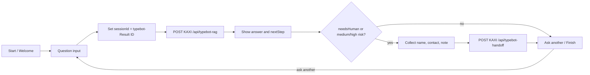

# KAXI Typebot RAG Workflow

Typebot never receives Supabase, OpenAI, or n8n signing secrets. The production request path is:

```txt
Typebot -> KAXI API -> signed n8n webhook -> Supabase pgvector
```

KAXI owns request validation, UUID/idempotency normalization, HMAC signing, canonical chat/retrieval persistence, encrypted handoff-task creation, attachment ownership, and the handoff token. n8n owns retrieval, grounded answer construction, risk classification, and metadata-only execution telemetry.

Active n8n production version: `4d732810-a380-49ed-a5d8-ab434f0057bb` (41 nodes). The KAXI verifier, Supabase migrations, 199/199 serving projection, and 12/12 multilingual evaluation gates pass. Typebot itself remains unpublished pending its separate release step.

## Typebot Runtime Request

Use a Typebot HTTP Request/Webhook block with server-side execution.

```txt
POST https://kaxi.vercel.app/api/typebot-rag
Content-Type: application/json
x-kaxi-typebot-token: <TYPEBOT_GATEWAY_SECRET>
Timeout: 45s
```

```json
{
  "question": "{{question}}",
  "sessionId": "typebot-{{Result ID}}",
  "typebotResultId": "{{Result ID}}",
  "tenant_id": "default",
  "category": "{{category}}",
  "source": "typebot",
  "locale": "ko"
}
```

`sessionId` must always equal `typebot-{{Result ID}}`. KAXI rejects a Typebot request when those values do not match. Both Typebot webhook blocks must execute server-side and send the same separate 32-byte `TYPEBOT_GATEWAY_SECRET`; never reuse the n8n signing secret.

## Response Mapping

KAXI returns fields at the top level. Do not prefix paths with `data.`.

```txt
answer        <- answer
needsHuman    <- needsHuman
riskLevel     <- riskLevel
leadStage     <- leadStage
nextStep      <- nextStep
sources       <- sources
handoffToken  <- handoffToken
```

The current Typebot MCP draft uses these exact body paths. A typical response is:

```json
{
  "answer": "문서 기준으로 확인한 답변",
  "needsHuman": false,
  "riskLevel": "low",
  "leadStage": "none",
  "nextStep": "학교와 관할 재외공관의 최신 안내를 확인하세요.",
  "sources": [
    {
      "docId": "d4-overview",
      "title": "D-4 한국어연수 안내",
      "sourceUrl": "https://www.visa.go.kr/",
      "checkedAt": "2026-07-03"
    }
  ],
  "searchMeta": {
    "type": "hybrid",
    "retrievedCount": 3,
    "topScore": 0.91
  },
  "requestId": "uuid",
  "executionId": "n8n-execution-id",
  "handoffToken": "short-lived-signed-token",
  "persisted": true,
  "messageId": "123"
}
```

## Conversation Flow



Category selection is optional. When Typebot sends an empty or unresolved `{{category}}`, the KAXI gateway infers `visa`, `documents`, `school`, `cost`, or `general` from the question before signing the n8n request.

## Handoff Request

Only show contact collection when `needsHuman=true`, `riskLevel=medium`, or `riskLevel=high`.

```txt
POST https://kaxi.vercel.app/api/typebot-handoff
Content-Type: application/json
x-kaxi-typebot-token: <TYPEBOT_GATEWAY_SECRET>
Timeout: 45s
```

```json
{
  "sessionId": "{{sessionId}}",
  "typebotResultId": "{{Result ID}}",
  "tenant_id": "default",
  "locale": "ko",
  "source": "typebot",
  "leadName": "{{leadName}}",
  "leadContact": "{{leadContact}}",
  "leadContactType": "",
  "leadNote": "{{leadNote}}",
  "question": "{{question}}",
  "answer": "{{answer}}",
  "riskLevel": "{{riskLevel}}",
  "leadStage": "{{leadStage}}",
  "handoffToken": "{{handoffToken}}"
}
```

Map the response from top-level `status` and `leadId`. KAXI verifies the short-lived token, confirms that the Typebot session exists, encrypts contact and free-form handoff PII, then sends a second signed webhook to n8n. Supabase updates the existing KAXI-owned `handoff_tasks` row and writes `leads` plus `lead_contacts` without exposing service credentials to Typebot.

## n8n Contracts

The governed n8n workflow exposes these production webhooks:

```txt
POST /webhook/typebot-rag-runtime
POST /webhook/rag-knowledge-ingest
POST /webhook/typebot-handoff-update
GET  /webhook/rag-serving-capabilities
```

The three POST webhooks require KAXI HMAC verification. The capability endpoint is non-sensitive deployment metadata and must return:

```json
{
  "service": "kaxi-rag-serving",
  "contractVersion": "2026-07-10.v1",
  "ingestionTarget": "rag_serving_chunks",
  "embeddingModel": "text-embedding-3-small",
  "dimensions": 1536,
  "signedIngestionRequired": true
}
```

`Build Context` accepts only citation-valid HTTPS sources with `checkedAt` and `checkedBy`. No-context and citation-validation failures produce a bounded answer and a review handoff. A generic information question remains low risk; personal regulated actions, low-confidence personal cases, and high-consequence immigration/legal questions are classified separately.

The active workflow preserves canonical `docId` in every returned citation, expands Korean/English/Vietnamese/Mongolian retrieval queries with bounded canonical hints, and treats forged-document expressions in all four languages as high risk. Evaluation run `ecf8361b-01be-41e8-8b29-0079ddd98602` passed 12/12 cases with 100% citation coverage.

## Release Order

Do not change this order:

1. Apply Supabase migrations and verify RLS.
2. Configure KAXI production secrets and webhook URLs.
3. Deploy KAXI and verify `/api/internal/n8n/verify` exists.
4. Publish the validated n8n draft and confirm the capability endpoint.
5. Run `bun run rag:serving:sync --execute --confirm-contract 2026-07-10.v1` until 199/199 eligible chunks are ready.
6. Run the RAG evaluation suite and require at least 85% pass rate.
7. Run `bun run rag:serving:cutover --execute --confirm CUTOVER_LEGACY_RAG --expected-ready 199`.
8. Publish the Typebot draft.
9. Test Typebot -> KAXI -> n8n -> Supabase, including no-context and handoff branches.

Current status: steps 1-6 are complete. Step 7 (legacy cutover), step 8 (Typebot publication), and the Typebot-specific portion of step 9 were intentionally not executed.

The sync command refuses to write unless the active n8n capability contract matches. The cutover command refuses to remove legacy rows until every eligible chunk has a ready 1536-dimensional embedding and citation metadata.

## Production Checks

- Typebot response mappings use `answer`, not `data.answer`.
- `sessionId` remains stable for the Typebot Result ID.
- Repeated high-risk requests create one open handoff task but still return and audit every execution.
- Failed KAXI/n8n turns are stored with `status=failed` and an `error_code`; a successful retry with the same idempotency key upgrades the canonical row.
- `chat_messages` is the canonical encrypted conversation and `handoff_tasks` is created from that message by KAXI; `n8n_audit_messages` must remain metadata-only execution telemetry.
- Database migration `20260710180000_n8n_audit_metadata_only` enforces that boundary even if a stale workflow attempts to write raw conversation content.
- Attachment buckets are private and attachment ownership is verified with the signed KAXI session cookie.
- Typebot stays unpublished until KAXI and n8n production contracts are live.
- KAXI and n8n contracts are now live; publishing Typebot and the guarded legacy cutover remain separate explicitly approved operations.
