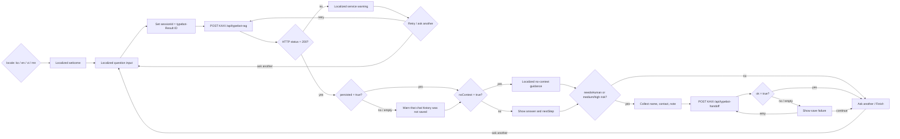

# KAXI Typebot RAG Workflow

Typebot never receives Supabase, OpenAI, or n8n signing secrets. The production request path is:

```txt
Typebot -> KAXI API -> signed n8n webhook -> KAXI RAG core -> governed Supabase RAG serving
```

KAXI owns request validation, UUID/idempotency normalization, HMAC signing, canonical chat/retrieval persistence, encrypted handoff-task creation, attachment ownership, retrieval, confidence policy, grounded answer construction, and risk classification. n8n verifies the signed request, obtains a short-lived payload-bound verification receipt, invokes the KAXI RAG core, and returns the response. Supabase owns the governed corpus and lexical/vector search functions.

The Promete workflow ID is `rB3nfjvCyTODP803`. The active semantic release is `kaxi-rag-runtime@2026-07-14.provider-independent-hybrid-v2`, using capability contract `2026-07-14.v3`. KAXI retrieves 20 lexical and 20 stored-vector candidates, then Reciprocal Rank Fusion selects the final six. A missing query-embedding provider uses the top three strict lexical hits to build a centroid from stored 1536-dimensional vectors; a configured provider that fails degrades to lexical-only retrieval. An n8n transport, quota, timeout, empty-body, 5xx, or response-contract failure falls back to the same KAXI/Supabase policy with `runtimePath=kaxi-direct-lexical`. Only a simultaneous n8n and Supabase failure returns the user-facing service failure.

## Typebot Runtime Request

Use a Typebot HTTP Request/Webhook block with server-side execution.

The published bot starts with a `locale` router. Embed and Runtime API callers must prefill `locale` with `ko`, `en`, `vi`, or `mn`; an absent or unsupported value falls back to Korean. Each branch owns all visible copy, input labels, privacy text, retry choices, no-context guidance, and its fixed webhook locale so a response can never switch languages mid-session.

```json
{
  "prefilledVariables": {
    "locale": "en"
  }
}
```

```txt
POST https://kaxi.vercel.app/api/typebot-rag
Content-Type: application/json
x-kaxi-typebot-token: <TYPEBOT_GATEWAY_SECRET>
Timeout: 45s
```

```json
{
  "question": "{{question}}",
  "sessionId": "typebot-{{sessionId}}",
  "typebotResultId": "{{sessionId}}",
  "tenant_id": "default",
  "category": "general",
  "source": "typebot",
  "locale": "<fixed branch locale>"
}
```

The `sessionId` variable is assigned from Typebot's Result ID before the request. The KAXI session ID must then equal `typebot-{{sessionId}}`, while `typebotResultId` carries the raw `{{sessionId}}` value. KAXI rejects a Typebot request when those values do not match. Both Typebot webhook blocks must execute server-side and send the same separate 32-byte `TYPEBOT_GATEWAY_SECRET`; never reuse the n8n signing secret.

## Response Mapping

KAXI returns fields at the HTTP response top level. Typebot's current HTTP Request expression context exposes that response as `data`, so response-variable mappings use these expressions:

```txt
answer        <- data?.answer ?? ""
needsHuman    <- data?.needsHuman ?? false
riskLevel     <- data?.riskLevel ?? "low"
leadStage     <- data?.leadStage ?? "none"
nextStep      <- data?.nextStep ?? ""
sources       <- data?.sources ?? []
handoffToken  <- data?.handoffToken ?? ""
persisted     <- data?.persisted ?? false
persistenceMode <- data?.persistenceMode ?? ""
httpStatus    <- statusCode ?? 500
noContext     <- data?.searchMeta?.noContext ?? false
noContextReason <- data?.searchMeta?.noContextReason ?? ""
```

All response mappings use null-safe expressions with explicit defaults. This clears values from the previous turn when an abnormal response omits its JSON body. The runtime checks `httpStatus=200` before reading `persisted` or rendering an answer. Any 4xx, 5xx, timeout, or network failure continues to a localized retry/ask-another choice instead of ending the chat or showing a stale answer.

The Typebot flow uses these exact mapping expressions. A typical response is:

```json
{
  "answer": "문서 기준으로 확인한 답변",
  "needsHuman": false,
  "riskLevel": "low",
  "leadStage": "none",
  "nextStep": "학교와 관할 재외공관의 최신 안내를 확인하세요.",
  "sources": [
    {
      "docId": "d4-overview",
      "title": "D-4 한국어연수 안내",
      "sourceUrl": "https://www.visa.go.kr/",
      "checkedAt": "2026-07-03"
    }
  ],
  "searchMeta": {
    "type": "hybrid",
    "retrievedCount": 3,
    "topScore": 0.91
  },
  "requestId": "uuid",
  "executionId": "n8n-execution-id",
  "workflowId": "rB3nfjvCyTODP803",
  "workflowVersionId": "kaxi-rag-runtime@2026-07-14.provider-independent-hybrid-v2",
  "modelVersion": "retrieval/hybrid-rrf-v3@2026-07-14",
  "promptVersion": "kaxi-grounded-extractive@2026-07-13.p0-v1",
  "handoffToken": "short-lived-signed-token",
  "persisted": true,
  "messageId": "123",
  "persistenceMode": "inserted"
}
```

The published Typebot checks `persisted` before showing the normal response path. `true` continues directly to the answer; `false` or an empty mapping shows a storage warning first, then preserves the answer so the user is not left without guidance. The published-runtime health check treats that warning as degraded even when an answer block is present.

The same four provenance fields are returned on validation, authorization, upstream, and persistence-error responses and are mirrored in `x-kaxi-workflow-id`, `x-kaxi-workflow-version-id`, `x-kaxi-model-version`, and `x-kaxi-prompt-version` headers. Canonical chat, retrieval, n8n audit, health, operations-event, and evaluation records store dedicated queryable columns for the same contract.

## Conversation Flow



Category selection is optional. When Typebot sends an empty or unresolved `{{category}}`, the KAXI gateway infers `visa`, `documents`, `school`, `cost`, or `general` from the question before signing the n8n request.

## Handoff Request

Only show contact collection when `needsHuman=true`, `riskLevel=medium`, or `riskLevel=high`.

```txt
POST https://kaxi.vercel.app/api/typebot-handoff
Content-Type: application/json
x-kaxi-typebot-token: <TYPEBOT_GATEWAY_SECRET>
Timeout: 45s
```

```json
{
  "sessionId": "{{sessionId}}",
  "typebotResultId": "{{Result ID}}",
  "tenant_id": "default",
  "locale": "ko",
  "source": "typebot",
  "leadName": "{{leadName}}",
  "leadContact": "{{leadContact}}",
  "leadContactType": "",
  "leadNote": "{{leadNote}}",
  "question": "{{question}}",
  "answer": "{{answer}}",
  "riskLevel": "{{riskLevel}}",
  "leadStage": "{{leadStage}}",
  "handoffToken": "{{handoffToken}}"
}
```

Map `handoffSaved <- data.ok`, plus `status <- data.status` and `leadId <- data.leadId`. `handoffSaved=true` shows the completed message. A false or empty value shows an explicit not-saved message with `retry` and `continue without handoff` choices; it never claims that an unconfirmed request was accepted. KAXI verifies the short-lived token, confirms that the Typebot session exists, encrypts contact and free-form handoff PII, then sends a second signed webhook to n8n. Supabase updates the existing KAXI-owned `handoff_tasks` row and writes `leads` plus `lead_contacts` without exposing service credentials to Typebot.

The handoff HTTP block separately maps `statusCode ?? 500` and requires HTTP 200 before checking `data.ok`. This prevents a previous successful `handoffSaved` value from being reused after a later failed request. Privacy-declined and no-context messages live in isolated one-block groups because Typebot executes adjacent bubble blocks in a group sequentially before following the group's edge.

## n8n Contracts

The governed n8n workflow exposes these production webhooks:

```txt
POST /webhook/typebot-rag-runtime
POST /webhook/rag-knowledge-ingest
POST /webhook/typebot-handoff-update
GET  /webhook/rag-serving-capabilities
```

The three POST webhooks require KAXI HMAC verification. The capability endpoint is non-sensitive deployment metadata and must return:

```json
{
  "service": "kaxi-rag-serving",
  "contractVersion": "2026-07-14.v3",
  "ingestionTarget": "rag_serving_chunks",
  "retrievalMode": "hybrid-rrf-v3-with-seeded-vector-and-lexical-fallback",
  "lexicalCandidateCount": 20,
  "vectorCandidateCount": 20,
  "finalMatchCount": 6,
  "embeddingModel": "text-embedding-3-small",
  "dimensions": 1536,
  "queryEmbeddingOptional": true,
  "storedVectorFallback": "lexical-centroid",
  "vectorSeedCount": 3,
  "providerFailureMode": "lexical-only",
  "signedIngestionRequired": true
}
```

The active runtime graph is intentionally small: `Typebot Runtime Webhook -> Verify Runtime Signature -> Input Guard -> Run KAXI RAG Core -> Respond to Typebot`. The verifier returns a short-lived HMAC receipt bound to the exact request payload; the RAG core rejects expired, reused-purpose, or payload-tampered receipts. n8n does not duplicate category inference, query expansion, reranking, confidence, answer, or risk logic.

KAXI calls `match_rag_documents_lexical_v2`, `seed_rag_query_embedding_from_lexical`, and `match_rag_documents_hybrid_v3`. Retrieval always passes a strict locale and category scope. Each candidate must have a citation-valid HTTPS source, `checkedAt`, `checkedBy`, and locale-consistent title/body. Locale mismatch, category mismatch, weak token coverage, or an insufficient top-score margin produces bounded `noContext` rather than borrowing another language or category.

The lexical rank combines normalized query aliases, title/doc ID/keyword/body weights, trigram similarity, exact match, source authority, freshness, and operational intent hints. Hybrid mode retrieves 20 lexical and 20 vector candidates and uses RRF to select six. Query embeddings may use a dedicated optional provider credential. With no provider, a centroid of stored vectors keeps pgvector retrieval active; when an explicitly configured provider fails, retrieval intentionally switches to lexical-only. The selected strategy and failure reason are recorded in `searchMeta`.

Run the staged suite with `bun run rag:evaluation:staged`. It executes 8 smoke, 16 locale, and 64 full cases. Each result records `runtimePath`, `retrievalRuntimePath`, fallback reason, embedding status, workflow/model/prompt provenance, persistence status, and citation IDs. Set `RAG_EVAL_SHADOW=true` to compare lexical, vector-only, and hybrid candidate sets with either provider vectors or the stored-vector centroid strategy. The completed run header is reconciled from observed response provenance instead of trusting a stale local environment value.

## Release Order

Do not change this order:

1. Apply Supabase migrations and verify RLS.
2. Configure KAXI production secrets and webhook URLs.
3. Deploy KAXI and verify `/api/internal/n8n/verify` exists.
4. Publish the validated n8n draft and confirm the capability endpoint.
5. Run `bun run rag:serving:sync --execute --confirm-contract 2026-07-14.v3` until all eligible chunks are ready.
6. Run the RAG evaluation suite and require at least 95% overall, 90% in every locale/category, 95% expected-document recall and no-context accuracy, 100% citation validity/strict category/locale-rerank/high-risk checks, and p95 latency at or below 10 seconds. Gateway-mode evaluation must omit an explicit category so KAXI's multilingual intent classifier is exercised.
7. Run `bun run rag:serving:cutover --execute --confirm CUTOVER_LEGACY_RAG --expected-ready 201`.
8. Publish the Typebot draft.
9. Test Typebot -> KAXI -> n8n -> Supabase, including no-context and handoff branches.

Current status on 2026-07-14: KAXI commit `d353086` is live and Promete workflow `rB3nfjvCyTODP803` is published with 34 nodes at active version `43253aa9-3290-408b-9920-9dd214f6a818`. Capability contract `2026-07-14.v3` reports provider-independent hybrid retrieval. Production gateway evaluations passed 8/8 smoke, 16/16 locale, and 64/64 full cases through `n8n-kaxi-orchestrated` plus `kaxi-direct-hybrid`; full run `8361bddb-5817-4e2b-98d0-72d08e6ecee3` has p95 3783ms and actual response provenance on all 64 rows. Shadow run `4684c616-3589-4199-bb05-0fce85743121` recorded 100% expected-document recall for lexical, vector, and hybrid candidate sets using `lexical-centroid`. A forced n8n outage also passed 64/64 through `kaxi-direct-lexical` with no user-facing failure. The published Typebot passed all four locale starts, the high-risk consent branch, and a real low-risk turn persisted through Typebot, KAXI, n8n execution `367`, and Supabase.

The sync command refuses to write unless the active n8n capability contract matches. The cutover command refuses to remove legacy rows until every eligible chunk has a ready 1536-dimensional embedding and citation metadata.

## Production Checks

- Typebot response mappings use `data.answer` and the corresponding `data.*` expressions in the HTTP Request block context.
- The published start router supports `ko`, `en`, `vi`, and `mn`; all visible flow copy and both webhook bodies stay in the selected locale.
- Runtime and handoff HTTP blocks map `statusCode` with a `500` default and route non-200 responses to localized recovery choices.
- `searchMeta.noContext=true` renders only the localized no-context message; the normal `answer` and `nextStep` blocks must not leak into that turn.
- Typebot maps `data.persisted` and `data.persistenceMode`; an unconfirmed chat write shows `block_<locale>_persistence_warning` before the answer.
- Typebot maps handoff `data.ok`; an unconfirmed handoff shows `block_<locale>_handoff_failed` and offers retry or return to general consultation.
- `sessionId` remains stable for the Typebot Result ID.
- Repeated high-risk requests create one open handoff task but still return and audit every execution.
- Failed KAXI/n8n turns are stored with `status=failed` and an `error_code`; a successful retry with the same idempotency key upgrades the canonical row.
- `chat_messages` is the canonical encrypted conversation and `handoff_tasks` is created from that message by KAXI; `n8n_audit_messages` must remain metadata-only execution telemetry.
- Database migration `20260710180000_n8n_audit_metadata_only` enforces that boundary even if a stale workflow attempts to write raw conversation content.
- Attachment buckets are private and attachment ownership is verified with the signed KAXI session cookie.
- Typebot was published only after the KAXI and n8n production contracts were live.
- The KAXI RAG core sends an explicit locale and strict category mode to lexical and optional vector retrieval; an empty or low-confidence strict result terminates in the no-context branch.
- KAXI, n8n, and Typebot are live; the explicitly approved legacy cutover completed with 100 rows retained in server-only quarantine and zero rows left in `knowledge_chunks`.
- Daily privacy retention deletes Typebot Results older than seven days through a dedicated provider API token; the token is never exposed to the browser or Typebot flow.
