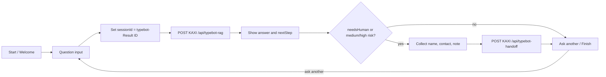

# KAXI Typebot RAG Workflow

Typebot never receives Supabase, OpenAI, or n8n signing secrets. The production request path is:

```txt
Typebot -> KAXI API -> signed n8n webhook -> Supabase pgvector
```

KAXI owns request validation, UUID/idempotency normalization, HMAC signing, canonical chat/retrieval persistence, encrypted handoff-task creation, attachment ownership, and the handoff token. n8n owns retrieval, grounded answer construction, risk classification, and metadata-only execution telemetry.

Active n8n production version: `f1a32f92-2211-44d7-bfc5-4d618c4ee02c` (41 nodes). The KAXI verifier, Supabase migrations, 201/201 serving projection, and 56/56 multilingual evaluation gates pass. Typebot is published and its normal-answer, high-risk, consent, and handoff paths have been verified against the production chain.

## Typebot Runtime Request

Use a Typebot HTTP Request/Webhook block with server-side execution.

```txt
POST https://kaxi.vercel.app/api/typebot-rag
Content-Type: application/json
x-kaxi-typebot-token: <TYPEBOT_GATEWAY_SECRET>
Timeout: 45s
```

```json
{
  "question": "{{question}}",
  "sessionId": "typebot-{{sessionId}}",
  "typebotResultId": "{{sessionId}}",
  "tenant_id": "default",
  "category": "{{category}}",
  "source": "typebot",
  "locale": "ko"
}
```

The `sessionId` variable is assigned from Typebot's Result ID before the request. The KAXI session ID must then equal `typebot-{{sessionId}}`, while `typebotResultId` carries the raw `{{sessionId}}` value. KAXI rejects a Typebot request when those values do not match. Both Typebot webhook blocks must execute server-side and send the same separate 32-byte `TYPEBOT_GATEWAY_SECRET`; never reuse the n8n signing secret.

## Response Mapping

KAXI returns fields at the HTTP response top level. Typebot's current HTTP Request expression context exposes that response as `data`, so response-variable mappings use these expressions:

```txt
answer        <- data.answer
needsHuman    <- data.needsHuman
riskLevel     <- data.riskLevel
leadStage     <- data.leadStage
nextStep      <- data.nextStep
sources       <- data.sources
handoffToken  <- data.handoffToken
```

The current Typebot MCP draft uses these exact body paths. A typical response is:

```json
{
  "answer": "문서 기준으로 확인한 답변",
  "needsHuman": false,
  "riskLevel": "low",
  "leadStage": "none",
  "nextStep": "학교와 관할 재외공관의 최신 안내를 확인하세요.",
  "sources": [
    {
      "docId": "d4-overview",
      "title": "D-4 한국어연수 안내",
      "sourceUrl": "https://www.visa.go.kr/",
      "checkedAt": "2026-07-03"
    }
  ],
  "searchMeta": {
    "type": "hybrid",
    "retrievedCount": 3,
    "topScore": 0.91
  },
  "requestId": "uuid",
  "executionId": "n8n-execution-id",
  "handoffToken": "short-lived-signed-token",
  "persisted": true,
  "messageId": "123"
}
```

## Conversation Flow



Category selection is optional. When Typebot sends an empty or unresolved `{{category}}`, the KAXI gateway infers `visa`, `documents`, `school`, `cost`, or `general` from the question before signing the n8n request.

## Handoff Request

Only show contact collection when `needsHuman=true`, `riskLevel=medium`, or `riskLevel=high`.

```txt
POST https://kaxi.vercel.app/api/typebot-handoff
Content-Type: application/json
x-kaxi-typebot-token: <TYPEBOT_GATEWAY_SECRET>
Timeout: 45s
```

```json
{
  "sessionId": "{{sessionId}}",
  "typebotResultId": "{{Result ID}}",
  "tenant_id": "default",
  "locale": "ko",
  "source": "typebot",
  "leadName": "{{leadName}}",
  "leadContact": "{{leadContact}}",
  "leadContactType": "",
  "leadNote": "{{leadNote}}",
  "question": "{{question}}",
  "answer": "{{answer}}",
  "riskLevel": "{{riskLevel}}",
  "leadStage": "{{leadStage}}",
  "handoffToken": "{{handoffToken}}"
}
```

Map the response from top-level `status` and `leadId`. KAXI verifies the short-lived token, confirms that the Typebot session exists, encrypts contact and free-form handoff PII, then sends a second signed webhook to n8n. Supabase updates the existing KAXI-owned `handoff_tasks` row and writes `leads` plus `lead_contacts` without exposing service credentials to Typebot.

## n8n Contracts

The governed n8n workflow exposes these production webhooks:

```txt
POST /webhook/typebot-rag-runtime
POST /webhook/rag-knowledge-ingest
POST /webhook/typebot-handoff-update
GET  /webhook/rag-serving-capabilities
```

The three POST webhooks require KAXI HMAC verification. The capability endpoint is non-sensitive deployment metadata and must return:

```json
{
  "service": "kaxi-rag-serving",
  "contractVersion": "2026-07-10.v1",
  "ingestionTarget": "rag_serving_chunks",
  "embeddingModel": "text-embedding-3-small",
  "dimensions": 1536,
  "signedIngestionRequired": true
}
```

`Build Context` accepts only citation-valid HTTPS sources with `checkedAt` and `checkedBy`. It validates `metadata.language`, `locale_filter`, the localized Markdown heading, and body script against the requested locale. Mismatched documents are rejected; if every citation-valid result is rejected, the workflow emits `noContextReason=locale_validation_failed` instead of leaking another language. Document titles come only from a heading that passes the locale check, otherwise a locale-specific neutral title is used.

The same node applies deterministic reranker `deterministic-locale-v2` before context construction. It combines the governed hybrid score with question/body token overlap, title overlap, strict category fit, keyword score, and citation validity, then deduplicates and keeps at most six documents. Returned sources include `language`, `rerankScore`, `originalRank`, and `titleSanitized`; `searchMeta` exposes `rawRetrievedCount`, `languageRejectedCount`, and `titleSanitizedCount`. This reranker adds no external LLM call or provider dependency.

No-context and citation-validation failures produce a bounded answer and a review handoff. A generic information question remains low risk; personal regulated actions, low-confidence personal cases, and high-consequence immigration/legal questions are classified separately.

`Search Governed Serving Chunks` must pass both `locale={{ $json.locale }}` and `category_mode=strict` to `match_rag_documents`. The RPC projects only the requested `ko`, `en`, `vi`, or `mn` Markdown sections from a canonical multilingual chunk. Its strict category scopes are `cost -> cost`, `visa -> visa/legal/process/warning`, `documents -> documents/legal/process/warning`, and `school -> school/documents/process`. If no eligible category or locale section remains, the RPC returns zero rows and the workflow must route to `Fallback No Context Answer`; it must not reuse context from another category or language.

The active workflow preserves canonical `docId` in every returned citation, expands Korean/English/Vietnamese/Mongolian retrieval queries with bounded canonical hints, and treats forged-document expressions in all four languages as high risk. Operational evaluation run `812f7634-d2c7-495b-8777-23634358d552` passed 56/56 cases with 100% citation validity, 100% high-risk recall, and 100% no-context accuracy. Overall citation coverage is 92.857% because the four intentional no-context cases correctly return no citations; citation-bearing answers have complete valid citations. Measured latency was p50 2543ms and p95 5392ms.

## Release Order

Do not change this order:

1. Apply Supabase migrations and verify RLS.
2. Configure KAXI production secrets and webhook URLs.
3. Deploy KAXI and verify `/api/internal/n8n/verify` exists.
4. Publish the validated n8n draft and confirm the capability endpoint.
5. Run `bun run rag:serving:sync --execute --confirm-contract 2026-07-10.v1` until 201/201 eligible chunks are ready.
6. Run the RAG evaluation suite and require at least 85% pass rate.
7. Run `bun run rag:serving:cutover --execute --confirm CUTOVER_LEGACY_RAG --expected-ready 201`.
8. Publish the Typebot draft.
9. Test Typebot -> KAXI -> n8n -> Supabase, including no-context and handoff branches.

Current status: steps 1-6 and step 8 are complete. Step 7 (legacy cutover) remains intentionally unexecuted. The normal-answer, high-risk, privacy-consent, and handoff portions of step 9 pass against the published bot; no-context and retry channel probes remain part of the next observation run.

The sync command refuses to write unless the active n8n capability contract matches. The cutover command refuses to remove legacy rows until every eligible chunk has a ready 1536-dimensional embedding and citation metadata.

## Production Checks

- Typebot response mappings use `data.answer` and the corresponding `data.*` expressions in the HTTP Request block context.
- `sessionId` remains stable for the Typebot Result ID.
- Repeated high-risk requests create one open handoff task but still return and audit every execution.
- Failed KAXI/n8n turns are stored with `status=failed` and an `error_code`; a successful retry with the same idempotency key upgrades the canonical row.
- `chat_messages` is the canonical encrypted conversation and `handoff_tasks` is created from that message by KAXI; `n8n_audit_messages` must remain metadata-only execution telemetry.
- Database migration `20260710180000_n8n_audit_metadata_only` enforces that boundary even if a stale workflow attempts to write raw conversation content.
- Attachment buckets are private and attachment ownership is verified with the signed KAXI session cookie.
- Typebot was published only after the KAXI and n8n production contracts were live.
- The runtime vector-search node sends an explicit locale and strict category mode; an empty strict result terminates in the no-context branch.
- KAXI, n8n, and Typebot are live; the guarded legacy cutover remains a separate explicitly approved operation.
