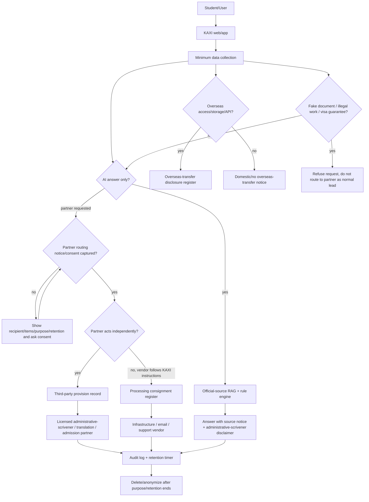

# Third-Party Provision / Consignment / Overseas Transfer Flow

Status: draft for legal review
Last checked: 2026-07-01
Review status: needs_legal_review

## Decision Rule

Use this decision tree before any data transfer:

1. Is KAXI transferring user data to an independent professional partner so that the partner can provide its own service to the user?
   - Treat as third-party provision unless counsel confirms another basis.
2. Is a vendor processing data only for KAXI operations under KAXI instructions?
   - Treat as processing consignment.
3. Is the data accessed, stored, processed, or made available outside Korea?
   - Add overseas-transfer disclosure/consent path as applicable.
4. Is the data unnecessary for the requested service?
   - Do not transfer.

## Flow Diagram

## Transfer Matrix

| Flow | Classification | Data | Consent/notice checkpoint | Storage/log |
| --- | --- | --- | --- | --- |
| User asks AI a general D-2/D-4 question | Internal processing / AI backend processing depending on backend | question, language, context docs | AI/privacy notice | chat log if persistence guard allows |
| User requests administrative-scrivener consultation | Third-party provision to independent partner | contact/lead ID, visa type, consultation topic, relevant profile facts | recipient/items/purpose/retention notice before transfer | partner request record + audit log |
| KAXI uses hosting/database/email vendor | Processing consignment | service records, logs, notification data | privacy policy consignment disclosure | vendor register |
| KAXI sends prompt to overseas AI API | Overseas transfer plus possible consignment/third-party analysis depending contract | prompt, retrieved context, answer | overseas-transfer disclosure and AI notice | AI request log/minimized record |
| Local Codex bridge processes prompt on operator Mac through KAXI proxy | Internal/contracted operation depending deployment owner | prompt/context | operational privacy notice; no overseas AI claim unless external API used | bridge logs minimized |
| Privacy deletion request | Internal legal obligation/rights handling | contact or exact question hash, request metadata | privacy rights notice | rights-handling record |

## Minimum Runtime Controls

- Partner transfer must be triggered only by explicit user request or clear confirmation.
- Partner transfer must fail closed with no `PartnerRequest` if active consent is missing for third-party provision, processing consignment notice, or overseas-transfer notice.
- Partner consent capture, missing-consent blocks, routing creation, deletion withdrawal, and retention expiry must be audit logged.
- Partner request response must redact sensitive free-text in UI/log summaries.
- Admin access to partner/audit data must require authenticated admin credentials.
- Production PII persistence must require encryption/hash secrets and managed DB policy.
- Retention automation must cover chat logs, leads, partner requests, consent expiry, and deletion-request records.
- Overseas-transfer table must be updated whenever AI/backend/hosting provider changes.

## Evidence Sources

- 개인정보보호위원회 안내서 목록: https://www.pipc.go.kr/np/cop/bbs/selectBoardList.do?bbsId=BS217&mCode=D010030000
- 개인정보 보호법: https://www.law.go.kr/LSW/lsInfoP.do?ancNo=21445&ancYd=20260310&efYd=20260911&lsiSeq=283839
